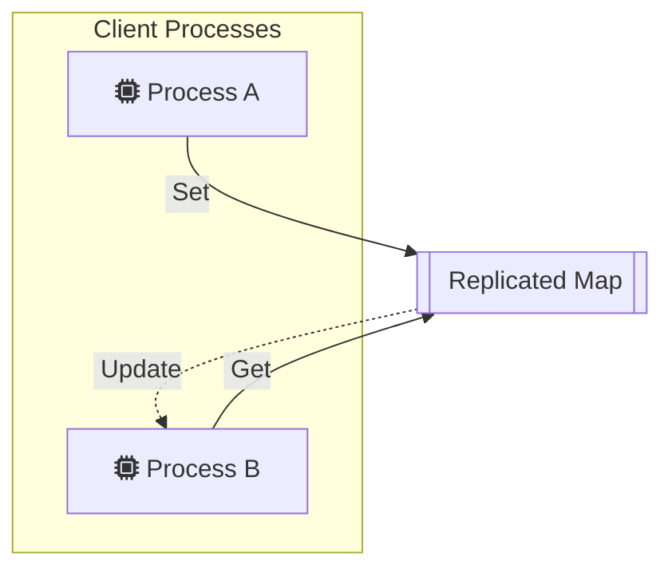
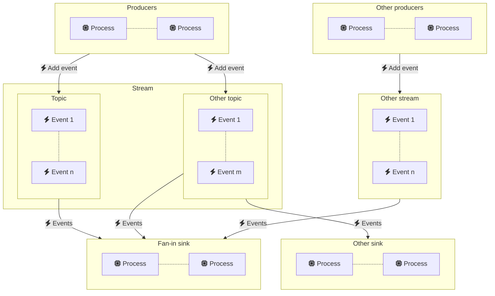
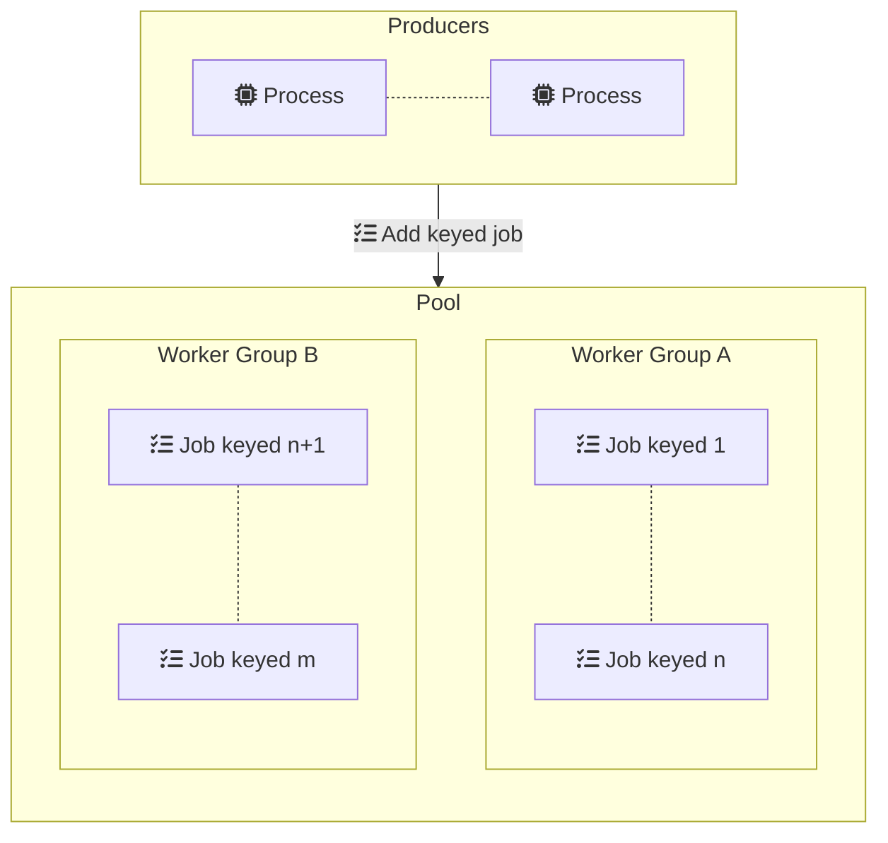

# Ponos

Ponos enables event driven distributed architectures by providing scalable
event streaming and tenanted worker pools based on Redis. 

## Replicated Maps

Replicated maps provide a mechanism for sharing data across a fleet of
microservices and receiving events when the data changes.

Replicated maps consist of an in-memory map of strings with copies shared across
all participating processes. Any process can update the replicated map, updates
are propagated within milliseconds across all processes. Replicated maps are
implemented using Redis hashes and pub/sub.

See the [replicated package README](replicated/README.md) for more details.

## Streams

Ponos streams provide a flexible mechanism for routing events across a fleet of
microservices. Event sinks can subscribe to multiple streams and consume events
concurrently. Streams can be used to implement pub/sub, fan-out and fan-in
topologies.

See the [streams package README](streams/README.md) for more details.

## Tenanted Worker Pool

Ponos builds on top of the [replicated](replicated/README.md) and
[streams](streams/README.md) packages to implement a tenanted worker pool where
jobs are distributed to worker groups based on a key.

See the [pool package README](pool/README.md) for more details.

## License

Ponos is licensed under the MIT license. See [LICENSE](LICENSE) for the full
license text.

## Contributing

See [CONTRIBUTING](CONTRIBUTING.md) for details on submitting patches and the
contribution workflow.

## Code of Conduct

This project adheres to the Contributor Covenant [code of conduct](CODE_OF_CONDUCT.md).
By participating, you are expected to uphold this code. Please report unacceptable
behavior to [ponos@goa.design](mailto:ponos@goa.design).

## Credits

Ponos was originally created by [Raphael Simon](@raphael).