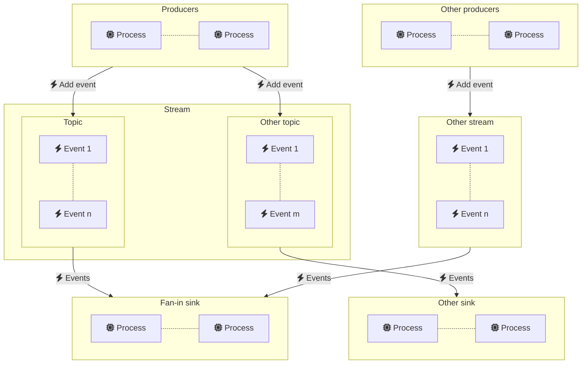

# Ponos

Ponos enables event driven distributed architectures by providing scalable
event streaming and tenanted worker pools based on Redis. 

## Streams

Ponos streams provide a flexible mechanism for routing events across a fleet of
microservices. Event sinks can subscribe to multiple streams and consume events
concurrently. Streams can be used to implement pub/sub, fan-out and fan-in
topologies.

See [Streams](streams/README.md) for more details.

## Tenanted Workers

Ponos builds on top of the [streams](streams/README.md) package to implement a tenanted worker pool.

## License

Ponos is licensed under the MIT license. See [LICENSE](LICENSE) for the full
license text.

## Contributing

See [CONTRIBUTING](CONTRIBUTING.md) for details on submitting patches and the
contribution workflow.

## Code of Conduct

This project adheres to the Contributor Covenant [code of conduct](CODE_OF_CONDUCT.md).
By participating, you are expected to uphold this code. Please report unacceptable
behavior to [ponos@goa.design](mailto:ponos@goa.design).

## Credits

Ponos was originally created by [Raphael Simon](@raphael).