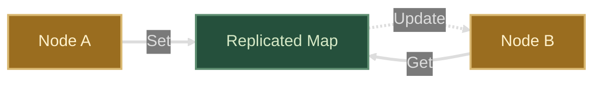
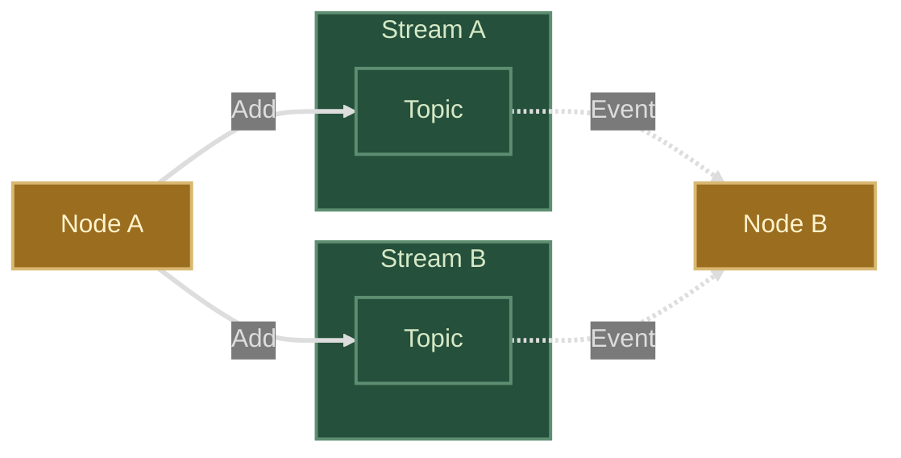

# Ponos

Ponos consists of a set of packages that enable event driven distributed
architectures at scale. Each package is designed to be used independently but
they can also be combined to implement more complex architectures.

## Replicated Maps

Replicated maps provide a mechanism for sharing data across distributed nodes
and receiving events when the data changes.

See the [replicated package README](replicated/README.md) for more details.

## Streams

Ponos streams provide a flexible mechanism for routing events across a fleet of
microservices. Streams can be used to implement pub/sub, fan-out and fan-in
topologies.

See the [streams package README](streams/README.md) for more details.

## Replicated Worker Pool

Ponos builds on top of [replicated maps](rmap/README.md) and
[streaming](streaming/README.md) to implement a tenanted worker pool where
jobs are distributed to worker groups based on a key.

See the [pool package README](pool/README.md) for more details.

## License

Ponos is licensed under the MIT license. See [LICENSE](LICENSE) for the full
license text.

## Contributing

See [CONTRIBUTING](CONTRIBUTING.md) for details on submitting patches and the
contribution workflow.

## Code of Conduct

This project adheres to the Contributor Covenant [code of conduct](CODE_OF_CONDUCT.md).
By participating, you are expected to uphold this code. Please report unacceptable
behavior to [ponos@goa.design](mailto:ponos@goa.design).

## Credits

Ponos was originally created by [Raphael Simon](@raphael).
