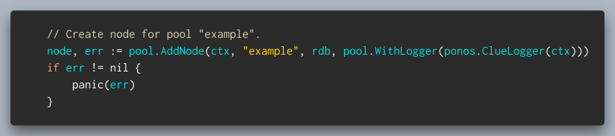
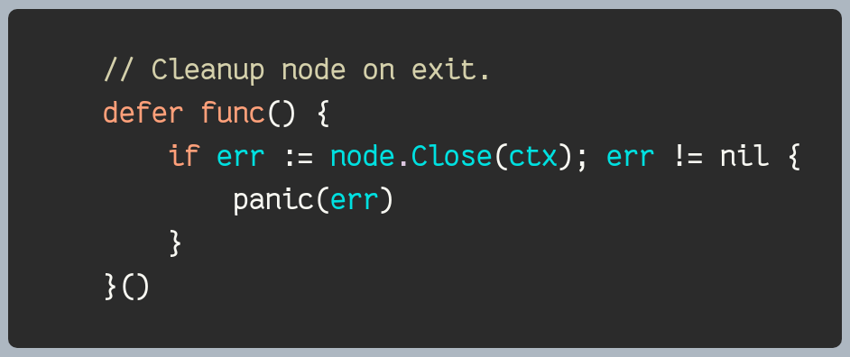
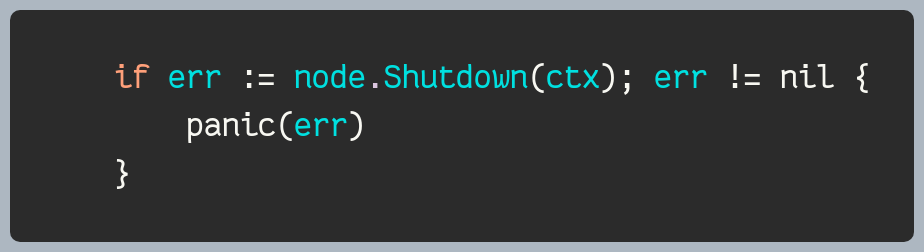
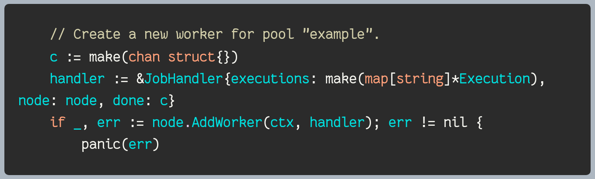
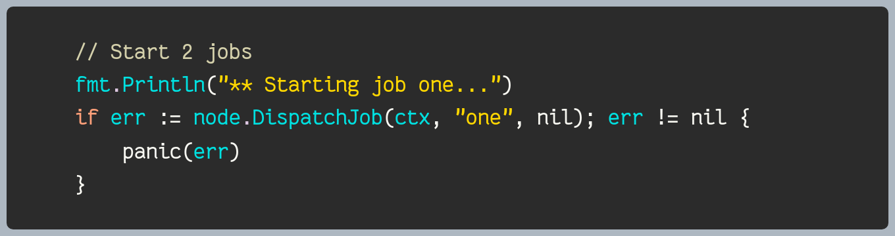
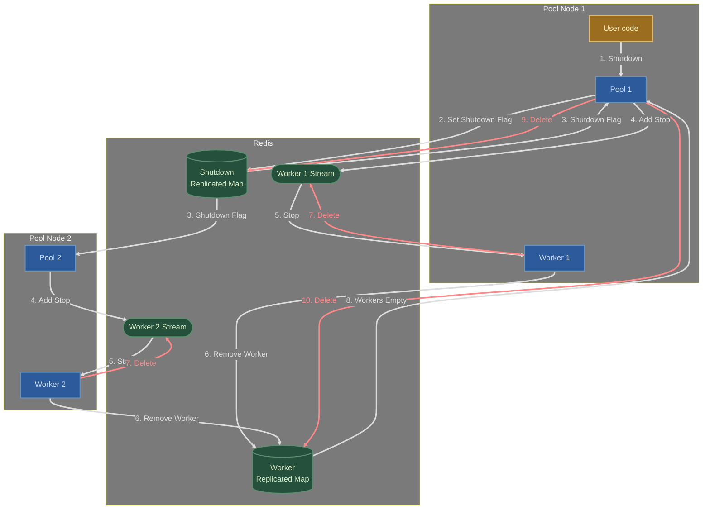

# Dedicated Worker Pool

The `pool` package builds on top of the Pulse [rmap](../rmap/README.md) and
[streaming](../streaming/README.md) packages to provide scalable and reliable
dedicated worker pools.

## Overview

A *dedicated* worker pool uses a consistent hashing algorithm to assign long
running jobs to workers. Each job is associated with a key and each worker with
a range of hashed values. The pool hashes the job key when the job is dispatched
to route the job to the proper worker.

Workers can be added or removed from the pool dynamically. Jobs get
automatically re-assigned to workers when the pool grows or shrinks. This makes
it possible to implement auto-scaling solutions, for example based on queueing
delays.

Pulse uses the [Jump Consistent Hash](https://arxiv.org/abs/1406.2294) algorithm
to assign jobs to workers which provides a good balance between load balancing
and worker assignment stability.


## Usage

Pulse dedicated worker pools are generally valuable when workers require
state which depends on the jobs they perform.

To illustrate, let's consider the scenario of a multitenant system that requires
managing a collection of background tasks for each tenant. In this case,
utilizing a Pulse worker pool proves to be highly beneficial. The system can
create a dedicated worker pool and create one job per tenant, utilizing the
unique tenant identifier as the job key. This approach ensures that only one
worker handles the background task for a specific tenant at any given time. As
new tenants are added or old ones are removed, jobs can be started or stopped
accordingly. Similarly, workers can be added or removed based on performance
requirements.

Pulse dedicated worker pools are not needed when workers are stateless and can
be scaled horizontally. In such cases, any standard load balancing solution can
be used.

### Creating A Pool

The function `AddNode` is used to create a new pool node. It takes as input a
name, a Redis client and a set of options.

[](../examples/pool/worker/main.go#L43-L47)

The `AddNode` function returns a new pool node and an error. The pool node
should be closed when it is no longer needed (see below).

The options are used to configure the pool node. The following options are
available:

* `WithLogger` - sets the logger to be used by the pool node.
* `WithWorkerTTL` - sets the worker time-to-live (TTL) in seconds. The TTL
  defines the maximum delay between two health-checks before a worker is removed
  from the pool. The default value is 10 seconds.
* `WithPendingJobTTL` - sets the pending job time-to-live (TTL) in seconds. The
  TTL defines the maximum delay between a worker picking up the job and
  successfully starting it. The default value is 20 seconds.
* `WithWorkerShutdownTTL` - specifies the maximum time to wait for a worker to
  shutdown gracefully. The default value is 2 minutes.
* `WithMaxQueuedJobs` - sets the maximum number of jobs that can be queued
  before the pool starts rejecting new jobs. The default value is 1000.
* `WithClientOnly` - specifies that the pool node should not starts
  background goroutines to manage the pool and thus not allow creating workers.
  This option is useful when the pool is used only to dispatch jobs to workers
  that are created in other nodes.
* `WithJobSinkBlockDuration` - sets the max poll duration for new jobs. This
  value is mostly used by tests to accelerate the pool shutdown process. The
  default value is 5 seconds.

### Closing A Node

The `Close` method closes the pool node and releases all resources associated
with it. It should be called when the node is no longer needed.

[](../examples/pool/producer/main.go#L31-L36)

Note that closing a pool node does not stop remote workers. It only stops the
local pool node. Remote workers can be stopped by calling the `Shutdown` method
described below.

### Shutting Down A Pool

The `Shutdown` method shuts down the entire pool by stopping all its workers
gracefully. It should be called when the pool is no longer needed.

[](../examples/pool/worker/main.go#L62-L64)

See the [Data Flows](#data-flows) section below for more details on the
shutdown process.

### Creating A Worker

The function `AddWorker` is used to create a new worker. It takes as input a job
handler object.

[](../examples/pool/worker/main.go#L55-L57)

The job handler must implement the `Start` and `Stop` methods used to start and
stop jobs. The handler may also optionally implement a `HandleNotification`
method to receive notifications.

[](worker.go#L59-L71)

The `AddWorker` function returns a new worker and an error. Workers can be
removed from pool nodes using the `RemoveWorker` method.

### Dispatching A Job

The `DispatchJob` method is used to dispatch a new job to the pool. It takes as
input a job key and a job payload.

[](../examples/pool/producer/main.go#L39-L42)

The job key is used to route the job to the proper worker. The job payload is
passed to the worker's `Start` method.

The `DispatchJob` method returns an error if the job could not be dispatched.
This can happen if the pool is full or if the job key is invalid.

### Notifications

Nodes can send notifications to workers using the `NotifyWorker` method. The method
takes as input a job key and a notification payload.  The notification payload
is passed to the worker's `HandleNotification` method.

### Stopping A Job

The `StopJob` method is used to stop a job. It takes a job key as input and
returns an error if the job could not be stopped. This can happen if the job key
is invalid, the node is closed or the pool shutdown.

## Data Flows

The following sections provide additional details on the internal data flows
involved in creating and using a Pulse worker pool. They are provided for
informational purposes only and are not required reading for simply using the
package.

### Adding A New Job

The following diagram illustrates the data flow involved in adding a new job to
a Pulse worker pool:

* The producer calls `DispatchJob` which adds an event to the pool job stream.
* The pool job stream is read by the pool sink running in one of the pool nodes.
  The routing node records the event so it can ack it later and routes the event
  to the proper worker stream using a consistent hashing algorithm.
* The dedicated worker stream is read by the worker which starts the job by
  calling the `Start` method on the worker job handler. Once `Start` returns
  successfully the worker sends an event back to the original pool node.
* Upon getting the event, the pool node acks the job with the
  pool job stream and removes it from its pending jobs map.


```mermaid
%%{ init: { 'flowchart': { 'curve': 'basis' } } }%%
%%{init: {'themeVariables': { 'edgeLabelBackground': '#7A7A7A'}}}%%
flowchart TD
    subgraph w[Worker Node]
        r[Reader]
        u[User code]
    end
    subgraph rdb[Redis]
        js(["Pool Job Stream (shared)"])
        ws(["Worker Stream (dedicated)"])
        rs(["Routing Node Stream (dedicated)"])
    end
    subgraph p[Producer Node]
        pr[User code]
        no[Client Node]
    end
    subgraph ro[Routing Node]
        ps[Pool Sink]
        nr[Routing Node Reader]
    end
    pr --1. DispatchJob--> no
    no --2. Add Job--> js
    js -.3. Job.-> ps
    ps --4. Add Job--> ws
    ws -.5. Job.-> r
    r --6. Start Job--> u
    r --7. Add Ack--> rs
    rs -.7. Ack.-> nr
    nr --8. Ack Add Job Event--> js
    
    classDef userCode fill:#9A6D1F, stroke:#D9B871, stroke-width:2px, color:#FFF2CC;
    classDef producer fill:#2C5A9A, stroke:#6B96C1, stroke-width:2px, color:#CCE0FF;
    classDef redis fill:#25503C, stroke:#5E8E71, stroke-width:2px, color:#D6E9C6;
    classDef background fill:#7A7A7A, color:#F2F2F2;

    class pr,u userCode;
    class pj,js,ws,rs redis;
    class no,ps,r,c,nr producer;
    class p,w,rdb,ro background; 

    linkStyle 0 stroke:#DDDDDD,color:#DDDDDD,stroke-width:3px;
    linkStyle 1 stroke:#DDDDDD,color:#DDDDDD,stroke-width:3px;
    linkStyle 2 stroke:#DDDDDD,color:#DDDDDD,stroke-width:3px;
    linkStyle 3 stroke:#DDDDDD,color:#DDDDDD,stroke-width:3px;
    linkStyle 4 stroke:#DDDDDD,color:#DDDDDD,stroke-width:3px;
    linkStyle 5 stroke:#DDDDDD,color:#DDDDDD,stroke-width:3px;
    linkStyle 6 stroke:#DDDDDD,color:#DDDDDD,stroke-width:3px;
    linkStyle 7 stroke:#DDDDDD,color:#DDDDDD,stroke-width:3px;
```

The worker pool uses a job stream so that jobs that do not get acknowledged in time
are automatically re-queued. This is useful in case of worker failure or
network partitioning. The pool sink applies the consistent hashing algorithm
to the job key to determine which worker stream the job should be added to. This
ensures that unhealthy workers are properly ignored when requeuing jobs.

### Shutdown and Cleanup

The following diagram illustrates the data flow involved in shutting down a
Pulse worker pool:

* The producer calls `Shutdown` which adds a shutdown event to the pool stream.
* Upon receving the shutdown event the pool node closes the pool stream to avoid
  accepting new jobs and sets a flag in the pool shutdown replicated map.
* The pool nodes get notified and stop accepting new jobs (`DispatchJob`
  returns an error if called).
* The pool nodes add a stop event to the worker streams for all the workers
  they own.
* Upon receiving the event, the workers remove themselves from the pool
  workers replicated map, destroy their stream and exit.  Note that any job that
  was enqueued before the shutdown event still gets processed.
* Once the workers have stopped, the producer that initiated the
  shutdown cleans up the pool resources (jobs sink, jobs stream, replicated maps)
  and the pool nodes exit.


