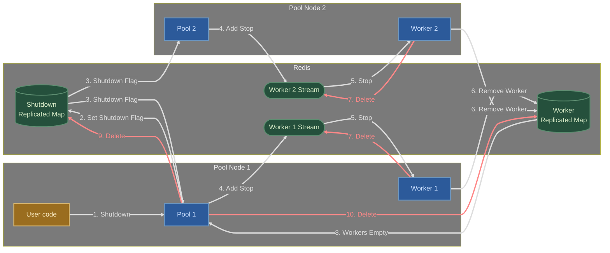

# Dedicated Worker Pool

The `pool` package builds on top of the Ponos [rmap](../rmap/README.md) and
[streaming](../streaming/README.md) packages to provide scalable and reliable
dedicated worker pools.

## Overview

A *dedicated* worker pool is a collection of workers that process jobs where each
worker is assigned a range of job keys. Jobs are distributed to workers based on
the job key and a consistent hashing algorithm.

Workers can be added or removed from the pool dynamically. Jobs get
automatically re-assigned to workers when the pool grows or shrinks. This makes
it possible to implement auto-scaling solutions, for example based on queueing
delays.

Ponos uses the [Jump Consistent Hash](https://arxiv.org/abs/1406.2294) algorithm
to assign jobs to workers which provides a good balance between load balancing
and worker assignment stability.


## Usage

Ponos dedicated worker pools are generally valuable when workers require
statefulness, and their state relies on the jobs they perform.

To illustrate, let's consider the scenario of a multitenant system that requires
managing a collection of background tasks for each tenant. In this case,
utilizing a Ponos worker pool proves to be highly beneficial. The system can
create a dedicated worker pool and create one job per tenant, utilizing the
unique tenant identifier as the job key. This approach ensures that only one
worker handles the background task for a specific tenant at any given time. As
new tenants are added or old ones are removed, jobs can be created to start or
stop the background tasks accordingly. Similarly, workers can be added or
removed based on performance requirements.

Ponos dedicated worker pools are not needed when workers are stateless and can
be scaled horizontally. In such cases, any standard load balancing solution can
be used.

## Example

The following example creates a worker pool named "fibonacci", the job payloads
consists of a single 64-bit unsigned integer. The worker computes the
[Fibonacci number](https://en.wikipedia.org/wiki/Fibonacci_number) of the
payload and prints it to stdout.

`worker.go`

```go
package main

import (
    "encoding/binary"

    redis "github.com/redis/go-redis/v9"
    "goa.design/ponos/pool"
)

func main() {
    // Connect to Redis
    rdb := redis.NewClient(&redis.Options{ Addr: "localhost:6379" })

    // Create node for pool "fibonacci".
    ctx := context.Background()
    node, err := pool.AddNode(ctx, "fibonacci", rdb)
    if err != nil {
        panic(err)
    }

    // Create a new worker for pool "fibonacci".
    worker, err := node.AddWorker(ctx)
    if err != nil {
        panic(err)
    }

    // Handle jobs
    for job := range worker.C {
        n := binary.BigEndian.Uint64(job.Payload)
        fmt.Printf("fib(%d)=%d\n", n, fib(n))
    }
}

func fib(n uint64) uint64 {
    if n <= 1 {
        return n
    }
    return fib(n-1) + fib(n-2)
}
```

`producer.go`

```go
package main

import (
    "encoding/binary"

    redis "github.com/redis/go-redis/v9"
    "goa.design/ponos/pool"
)

func main() {
    // Connect to Redis
    rdb := redis.NewClient(&redis.Options{ Addr: "localhost:6379" })

    // Add client-only node
    ctx := context.Background()
    node, err := pool.AddNode(ctx, "fibonacci", rdb, pool.WithClientOnly())
    if err != nil {
        panic(err)
    }

    // Queue new job with key "key" and payload 42 
    payload := make([]byte, 8)
    binary.BigEndian.PutUint64(payload, 42)
    if err := node.DispatchJob(ctx, "key", payload); err != nil {
        panic(err)
    }

    // Gracefully shutdown the pool
    if err := node.Shutdown(ctx); err != nil {
        panic(err)
    }
}
```

## Data Flows

The following sections provide additional details on the internal data flows
involved in creating and using a Ponos worker pool. They are provided for
informational purposes only and are not required to use the package.

### Adding A New Job

The following diagram illustrates the data flow involved in adding a new job to
a Ponos worker pool:

* The producer calls `DispatchJob` which adds an event to the pool job stream.
* The pool job stream is read by the pool sink which creates an entry in the
   pending jobs map and adds the job to the dedicated worker stream.
* The dedicated worker stream is read by the worker which adds the job to its
  channel.
* The worker user code reads the job from its channel and processes it.
* The worker marks the job as completed in the pending jobs map.
* The pool sink gets notified of the completed job, acks the job from the
  pool job stream and removes it from the pending jobs map.


```mermaid
%%{ init: { 'flowchart': { 'curve': 'monotoneX' } } }%%
%%{init: {'themeVariables': { 'edgeLabelBackground': '#7A7A7A'}}}%%
flowchart LR
    subgraph p[Producer Process]
        pr[User code] --1. DispatchJob--> po[Pool]
        ps
    end
    subgraph w[Worker Process]
        r[Reader] --7. Add Job--> c[[Worker Channel]]
        c -.Job.-> u[User code]
    end
    subgraph rdb[Redis]
        r --8. Mark Job Complete--> pj
        pj -.9. Notify.-> ps
        ps --11. Delete Pending Job--> pj
        po --2. Add Job--> js([Pool Job Stream])
        ps --10. Ack Job--> js
        js -.3. Job.-> ps[Pool Sink]
        ps --4. Set Pending Job--> pj[(Pending Jobs <br/> Replicated Map)]
        ps --5. Add Job--> ws(["Worker Stream (dedicated)"])
        ws -.6. Job.-> r
    end
    
    classDef userCode fill:#9A6D1F, stroke:#D9B871, stroke-width:2px, color:#FFF2CC;
    classDef producer fill:#2C5A9A, stroke:#6B96C1, stroke-width:2px, color:#CCE0FF;
    classDef ponos fill:#25503C, stroke:#5E8E71, stroke-width:2px, color:#D6E9C6;
    classDef background fill:#7A7A7A, color:#F2F2F2;

    class pr,u userCode;
    class pj,js,ws ponos;
    class po,ps,r,c producer;
    class p,w,rdb background; 

    linkStyle 0 stroke:#DDDDDD,color:#DDDDDD,stroke-width:3px;
    linkStyle 1 stroke:#DDDDDD,color:#DDDDDD,stroke-width:3px;
    linkStyle 2 stroke:#DDDDDD,color:#DDDDDD,stroke-width:3px;
    linkStyle 3 stroke:#DDDDDD,color:#DDDDDD,stroke-width:3px;
    linkStyle 4 stroke:#DDDDDD,color:#DDDDDD,stroke-width:3px;
    linkStyle 5 stroke:#DDDDDD,color:#DDDDDD,stroke-width:3px;
    linkStyle 6 stroke:#DDDDDD,color:#DDDDDD,stroke-width:3px;
    linkStyle 7 stroke:#DDDDDD,color:#DDDDDD,stroke-width:3px;
    linkStyle 8 stroke:#DDDDDD,color:#DDDDDD,stroke-width:3px;
    linkStyle 9 stroke:#DDDDDD,color:#DDDDDD,stroke-width:3px;
    linkStyle 10 stroke:#DDDDDD,color:#DDDDDD,stroke-width:3px;
    linkStyle 11 stroke:#DDDDDD,color:#DDDDDD,stroke-width:3px;
```

The worker pool uses a job stream so that jobs that do not get acknowledged in time
are automatically re-queued. This is useful in case of worker failure or
network partitioning. The pool sink applies the consistent hashing algorithm
to the job key to determine which worker stream the job should be added to. This
ensures that unhealthy workers are properly ignored when requeuing jobs.

### Shutdown and Cleanup

The following diagram illustrates the data flow involved in shutting down a
Ponos worker pool:

* The producer calls `Shutdown` which sets the shutdown flag in the pool
  shutdown replicated map.
* The pool nodes get notified and stop accepting new jobs (`DispatchJob`
  returns an error if called).
* The pool nodes add a stop event to the worker streams for all the workers
  they own.
* Upon receiving the stop event, the workers remove themselves from the pool
  workers replicated map and exit.  Note that any job that was enqueued before
  the stop event still gets processed.
* Once the workers replicated map is empty, the producer that initiated the
  shutdown cleans up the pool resources (jobs sink, jobs stream, replicated
  maps) and the pool nodes exit.


