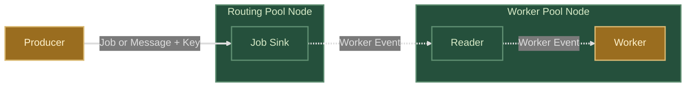
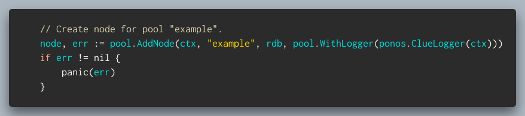
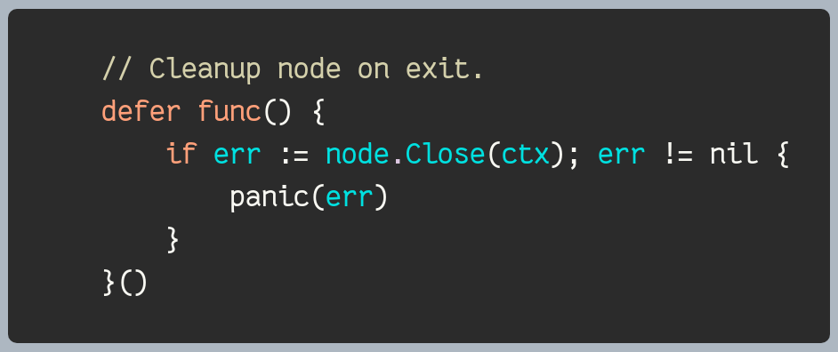
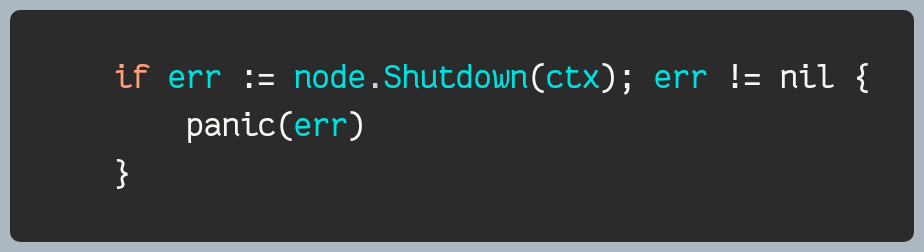
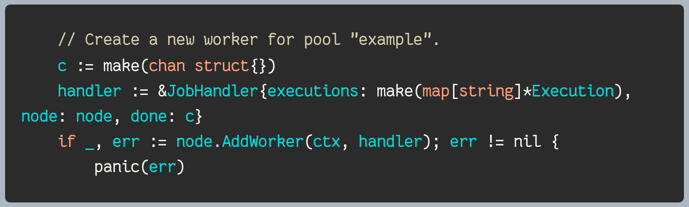
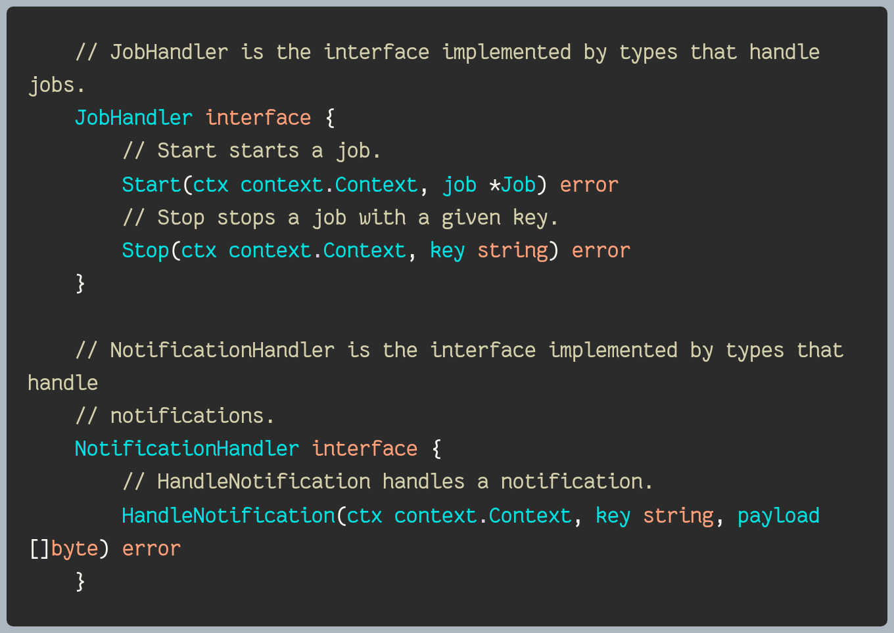
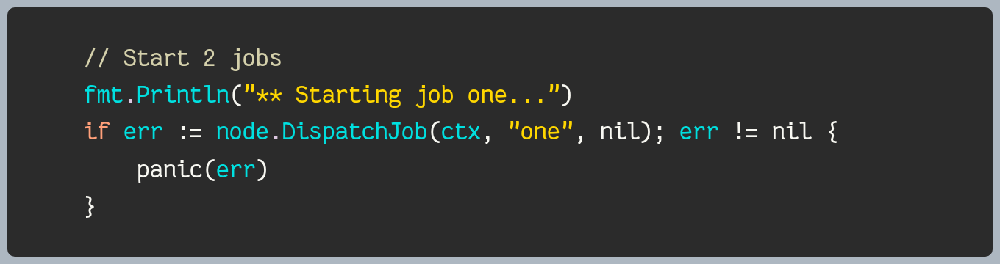

# Dedicated Worker Pool

The `pool` package builds on top of the Pulse [rmap](../rmap/README.md) and
[streaming](../streaming/README.md) packages to provide scalable and reliable
dedicated worker pools.

## Overview

A *dedicated* worker pool uses a consistent hashing algorithm to route keyed
work to workers. Durable jobs use the key to choose the worker that owns and
executes the job. Keyed messages use the same hash ring for short-lived work
without creating job ownership.

Workers can be added or removed from the pool dynamically. Jobs get
automatically re-assigned to workers when the pool grows or shrinks. This makes
it possible to implement auto-scaling solutions, for example based on queueing
delays.

Pulse uses the [Jump Consistent Hash](https://arxiv.org/abs/1406.2294) algorithm
to assign keys to workers, which provides a good balance between load balancing
and worker assignment stability.


```mermaid
%%{init: {'themeVariables': { 'edgeLabelBackground': '#7A7A7A'}}}%%
flowchart LR
    A[Producer]
    subgraph Pool["<span style='margin: 0 10px;'>Routing Pool Node</span>"]
        Sink["Job Sink"]
    end
    subgraph Worker[Worker Pool Node]
        Reader
        B[Worker]
    end
    A-->|Job or Message + Key|Sink
    Sink-.->|Worker Event|Reader
    Reader-.->|Worker Event|B

    classDef userCode fill:#9A6D1F, stroke:#D9B871, stroke-width:2px, color:#FFF2CC;
    classDef pulse fill:#25503C, stroke:#5E8E71, stroke-width:2px, color:#D6E9C6;

    class A,B userCode;
    class Pool,Sink,Reader,Worker pulse;

    linkStyle 0 stroke:#DDDDDD,color:#DDDDDD,stroke-width:3px;
    linkStyle 1 stroke:#DDDDDD,color:#DDDDDD,stroke-width:3px;
    linkStyle 2 stroke:#DDDDDD,color:#DDDDDD,stroke-width:3px;
```

## Usage

Job producer:
```go
	rdb := redis.NewClient(&redis.Options{Addr: "localhost:6379"})
	node, err := pool.AddNode(ctx, "example", rdb, pool.WithClientOnly())
	if err != nil {
		panic(err)
	}
	if err := node.DispatchJob(ctx, "key", []byte("payload")); err != nil {
		panic(err)
	}
```

Worker:
```go
	rdb := redis.NewClient(&redis.Options{Addr: "localhost:6379"})
	node, err := pool.AddNode(ctx, "example", rdb)
	if err != nil {
		panic(err)
	}
	handler := &JobHandler{}
	_, err := node.AddWorker(context.Background(), handler)
  if err != nil {
		panic(err)
	}
```

Job handler:
```go
type JobHandler struct {
	// ...
}

// Pulse calls this method to start a job that was assigned to this worker.
func (h *JobHandler) Start(job *pool.Job) error {
	// ...
}

// Pulse calls this method to stop a job that was assigned to this worker.
func (h *JobHandler) Stop(key string) error {
	// ...
}

// Pulse calls this method when a message key hashes to this worker.
func (h *JobHandler) HandleMessage(key string, payload []byte) error {
	// ...
}

// Pulse calls this method when this worker owns the notified job key.
func (h *JobHandler) HandleNotification(key string, payload []byte) error {
	// ...
}
```

### Creating A Pool

The function `AddNode` is used to create a new pool node. It takes as input a
name, a Redis client and a set of options.

[](../examples/pool/worker/main.go#L53-L57)

The `AddNode` function returns a new pool node and an error. The pool node
should be closed when it is no longer needed (see below).

The options are used to configure the pool node. The following options are
available:

* `WithClientOnly` - specifies that this node will only be used to dispatch jobs to
  workers in other nodes, and will not run any workers itself.
* `WithLogger` - sets the logger to be used by the pool node.
* `WithWorkerTTL` - sets the worker time-to-live (TTL). This is the maximum duration
  a worker can go without sending a health check before it's considered inactive
  and removed from the pool. If a worker doesn't report its status within this
  time frame, it will be removed, allowing the pool to reassign its jobs to other
  active workers. It is immutable for the pool generation and every node,
  including client-only nodes, must configure the same value. The same Redis-time
  threshold governs stale workers and stale nodes. The default value is 30 seconds.
* `WithRequeueTimeout` - bounds one local worker's concurrent requeue
  handoff attempt during graceful removal or `Close`. It does not govern remote
  takeover: `WithWorkerTTL` determines stale-worker liveness and Redis owns a
  renewable cleanup lease for each stale worker. Pulse cannot forcibly
  terminate application handler goroutines. The default is 2 minutes.
  `WithWorkerShutdownTTL` remains as a deprecated v1-compatible alias.
* `WithMaxQueuedJobs` - sets the immutable generation-wide count of active
  job-key admissions. Admission fails with `ErrPoolCapacity` at the limit.
  The default is 1000.
* `WithDispatchTimeout` - sets how long a caller waits for the worker result.
  Timeout removes only the local waiter; durable admission remains until a
  definitive worker completion. The default is 40 seconds.
* `WithDispatchResultRetention` - sets the immutable generation-wide replay
  window for terminal `DispatchJobOnce` results. It must exceed both dispatch
  timeout and recovery grace. During this window, any node retrying the same
  dispatch ID and exact identity receives the original event ID and terminal
  outcome. After expiry that replay guarantee ends and the ID may be admitted
  as a new dispatch. The default is five minutes.
* `WithRecoveryGrace` - sets sink stale recovery and orphan convergence grace.
  The default is 20 seconds. `WithAckGracePeriod` remains as a deprecated
  v1-compatible alias.
* `WithCleanupLease` - sets the immutable durable pool-cleanup owner lease.
  Cleanup renews this Redis-time lease before each destructive generation-owned
  step; if the owner dies, another process may take over only after the lease is
  stale. It does not govern worker or node liveness. The default is 30 seconds.

`DispatchJobOnce` accepts a caller-owned, globally unique dispatch ID. One Lua
operation stores its exact length-delimited job-key and payload identity,
claims the separate job-key admission index, appends the untrimmed start event,
and records its event ID. An exact retry returns that event ID or its original
terminal outcome; reusing the ID with different bytes returns
`ErrDispatchConflict`. Another active dispatch for the key returns
`ErrJobExists`. Terminal settlement atomically persists the result, clears
admission, acknowledges the consumer event, advances recovery, and deletes the
settled event. Active dispatch records have no expiry. Settlement removes them
from the active cleanup index and applies `DispatchResultRetention` to the
per-dispatch terminal record, bounding replay memory. Callers on every node use
local completion only as a wake-up hint and re-read that record after polling,
notification, cancellation, and timeout edges. Once a handler returns, its node
owns retrying settlement independently of worker intake cancellation. Worker
removal and graceful node closure join those obligations and report an error
while any remain pending. If the process dies first, the original pool event
remains pending with its dispatch ID and active record; sink recovery may
re-execute the handler under that same identity. Because a process can die
after the handler's external side effect but before settlement, handlers must
make those side effects idempotent or fence them with the dispatch identity.
Pool events are never MAXLEN-trimmed while unsettled.

Schedulers acquire one renewable Redis-time owner for each due transition.
That exact owner remains fenced across planning,
start/apply/stop work, authoritative ownership scans, and canonical next-time
commit; no later tick can be claimed while the transition remains live. Each
job first receives one persisted scheduler dispatch ID and is then admitted
through the same owner fence. A foreign `ErrJobExists` never proves scheduler
ownership. Stop and StopAll publish a stop only when both the transition lease
and exact scheduler dispatch capability remain current, so ordinary jobs and
jobs owned by another schedule are untouched. The v1 `JobProducer.Plan()`
contract remains supported and is inherently non-cancellable. Producers whose
planning may block should also implement `ContextJobProducer.PlanContext(ctx)`;
the scheduler prefers that method, and `Node.Close` cancels and joins it.

`StopJob` durably publishes a stop request and returns after Redis accepts that
request. It does not mean the current handler has already completed; observe
worker/job state when completion matters.

### Quiescent upgrades

This is a persisted pool-format cutover, not a Go API major-version migration;
the v1 producer interface and deprecated option aliases remain source
compatible.

The generation/resource and dispatch wire formats do not support mixed
versions. Upgrade a pool by: (1) stop every producer, client-only node, routing
node, worker, and scheduler; (2) verify every flat map listed below contains no
user entries, discover and check legacy per-producer scheduler maps, and verify
the flat pool stream has no entries or groups; (3)
deploy the new version everywhere; (4) start one node and verify its resource
manifest has `format_version=7`, generation-qualified scheduler resources, and
the intended `max_queued_jobs`, `worker_ttl_ms`, `cleanup_lease_ms`, and
`dispatch_result_retention_ms`; then (5)
resume the remaining nodes and producers. The first upgraded node refuses to
adopt manifestless legacy resources while any actual flat resource proves a
writer may still be active, returning `ErrQuiescenceRequired`.

For a pool named `$POOL`, inspect the exact standalone-Redis evidence before
deploying. Every map below must contain no fields except rmap metadata
(`=rev`/`=kind`), and both stream commands must report no retained work or
consumer groups:

```bash
redis-cli HGETALL "map:${POOL}:node-keepalive:content"
redis-cli HGETALL "map:${POOL}:shutdown:content"
redis-cli HGETALL "map:${POOL}:workers:content"
redis-cli HGETALL "map:${POOL}:worker-keepalive:content"
redis-cli HGETALL "map:${POOL}:worker-cleanup:content"
redis-cli HGETALL "map:${POOL}:jobs:content"
redis-cli HGETALL "map:${POOL}:pending-jobs:content"
redis-cli HGETALL "map:${POOL}:dispatches:content"
redis-cli HGETALL "map:${POOL}:job-payloads:content"
redis-cli HGETALL "map:${POOL}:tickers:content"
redis-cli HGETALL "map:${POOL}:scheduler-jobs:content"
redis-cli --scan --pattern "map:${POOL}:*:content"
redis-cli XLEN "pulse:stream:${POOL}:pool"
redis-cli XINFO GROUPS "pulse:stream:${POOL}:pool"
redis-cli --scan --pattern "pulse:stream:${POOL}:node:*"
```

Inspect every key returned by the scheduler-map scan; legacy versions created
dynamic `map:${POOL}:<producer>:content` hashes. Any non-metadata field requires
the old writer to be stopped before upgrade. Once all listed evidence proves
quiescence, first adoption may delete orphaned bare
`pulse:stream:${POOL}:node:<node-id>` streams that have no lifecycle record.
This store-owned upgrade cleanup is not part of normal `Stream.Destroy`.

After the first upgraded node starts, verify the selected generation contract
with `redis-cli HGETALL "pulse:pool:${POOL}:resources"`.

Rollback requires the same stop-all-users boundary. Do not start an older
binary against a manifest already marked format 7; restore Redis from the
pre-upgrade snapshot or complete cleanup and create a fresh pool generation
before starting the older version.

### Closing A Node

The `Close` method closes the pool node and releases all resources associated
with it. It should be called when the node is no longer needed. Closing is an
immediate admission fence: once it begins, the node rejects new workers, job or
message dispatches, stop requests, and notifications while already admitted
operations finish.

[](../examples/pool/producer/main.go#L66-L70)

Note that closing a pool node does not stop remote workers. It only stops the
local pool node. Remote workers can be stopped by calling the `Shutdown` method
described below.

### Shutting Down A Pool

The `Shutdown` method shuts down the entire pool by stopping all its workers
gracefully. It should be called when the pool is no longer needed. Shutdown
publishes one Redis-owned obligation even when a local `Close` is concurrent.
After every live node detaches, final cleanup is owned by a persisted
owner-and-lease claim based on Redis time. Another process can reclaim an
expired claim and finish cleanup, so an interrupted shutdown cannot permanently
block reuse of the pool name. Successful cleanup compacts the claim to one
bounded generation completion marker. Every destructive stream or map mutation
atomically verifies the exact cleanup generation, owner, and unexpired lease;
a paused former owner cannot delete resources created after takeover and pool
reuse.

Stale worker and node takeover use the same rule at a narrower scope. One Lua
operation reads the authoritative heartbeat, compares it with immutable
`WorkerTTL` using Redis time, and installs an exact owner/fence. Heartbeat
scripts reject that fence, and every mutation a resumed stale process could
attempt re-verifies liveness at its own Redis linearization point: a worker
start claim re-checks the worker's registration and cleanup fence, graceful
requeue deactivation refuses under a fence and never recreates a removed
registration, and job dispatch plus every scheduler transition and ownership
script re-check the node's keep-alive registration and node-cleanup field.
Requeue, dispatch-release, stream destruction, and discovery removal verify
the same unexpired owner token.

The pool stream generation selects every shared map and stream as one immutable
resource manifest. The first deployment seen by this version adopts existing
flat names without migration. After explicit shutdown cleanup, the next
generation uses qualified names. A paused stale node therefore retains access
only to its old keepalive, worker, job, ticker, scheduler, dispatch-record, and
stream resources and cannot mutate a reused pool. Every node-owned map mutation also
checks that exact stream generation inside the same Redis operation, preventing
a paused stale node from recreating an old map key after cleanup.

[](../examples/pool/worker/main.go#L90-L92)

See the [Data Flows](#data-flows) section below for more details on the
shutdown process.

### Creating A Worker

The function `AddWorker` is used to create a new worker. It takes as input a job
handler object.

[](../examples/pool/worker/main.go#L59-L63)

The job handler must implement the `Start` and `Stop` methods used to start and
stop durable jobs. The handler may also implement `HandleMessage` to receive
keyed messages and `HandleNotification` to receive job-scoped notifications.

[](worker.go#L68-L87)

The `AddWorker` function returns a new worker and an error. Workers can be
removed from pool nodes using the `RemoveWorker` method.

### Dispatching A Job

The `DispatchJob` method is used to dispatch a new job to the pool. It takes as
input a job key and a job payload.

[](../examples/pool/producer/main.go#L39-L42)

The job key is used to route the job to the proper worker. If the worker starts
the job successfully, the worker owns that key until the job stops or moves
during rebalancing. The job payload is passed to the worker's `Start` method.

Pulse establishes the durable dispatch record in the same operation that
publishes the start event, so even an immediate worker acknowledgement cannot
outrun correlation. Concurrent local retries share one broadcast completion
signal. If a caller cancels or times out while completion is unknown, Pulse
retains job-key admission and removes only that caller's wait. Definitive worker
acknowledgement persists the terminal record and releases admission even if the
caller or dispatching process is gone. Job keys are reusable command identities:
while a start is
pending or the job is running, duplicates return `ErrJobExists`; after
definitive completion and a later stop removes ownership, the same key may be
dispatched again. `DispatchJob` also returns errors for invalid keys, duplicate
active/pending jobs, and worker start failures.

If a worker's `Start` handler fails, Pulse atomically removes that worker's
ownership and the durable payload before it publishes the failure
acknowledgement or releases singleton admission. A Redis failure during this
cleanup leaves the start event pending for retry; it is never reported as
complete with orphaned ownership or payload.

### Dispatching A Message

The `DispatchMessage` method sends a keyed, fire-and-forget message to the
worker currently assigned by the pool hash ring. Messages are the right primitive
for short-lived work that needs stable key-based routing but must not create a
durable job.

Pool streams are poison-message tolerant: malformed external binary envelopes,
jobs, acknowledgements, and keyed payloads are logged and acknowledged as
terminal malformed input. Routing and worker loops continue processing later
valid events.

Messages do not write job payloads and do not require any worker to own a job
with the same key. The receiving worker must implement `HandleMessage`. A
message handler can return `ErrRequeue` to leave the message pending for
redelivery; any other error is treated as terminal.

### Notifications

Nodes can send notifications to workers using the `NotifyWorker` method. A
notification is a job control event: it targets the worker that currently owns an
existing job key and passes the notification payload to that worker's
`HandleNotification` method.

Use `NotifyWorker` when the message only makes sense for the active owner of an
existing job. Use `DispatchMessage` when there is no durable job with the same
key.

### Stopping A Job

The `StopJob` method is used to stop a job. It takes a job key as input and
returns an error if the job could not be stopped. This can happen if the job key
is invalid, the node is closed or the pool shutdown.

## Scheduling

The `Schedule` method of the `Node` struct can be used to schedule jobs to be
dispatched or stopped on a recurring basis. The method takes as input a job
producer and invokes it at the specified interval. The job producer returns
a list of jobs to be started and stopped.

The producer's shared ticker establishes distributed ownership before the
initial `Plan` and every later transition, so same-name producers on different
nodes do not plan concurrently. Applied job ownership is canonical in the
generation-qualified scheduler map. Planning, dispatch, stop, and ownership-map
failures return to the tick owner and are retried on a later owned transition;
they are never treated as successful progress. Scheduler intervals use
millisecond precision and must be at least one millisecond.

`Schedule` makes it possible to maintain a pool of jobs for example in a
multi-tenant system. See the [examples](../examples/pool) for more details.
