# Streaming

Ponos leverages Redis streams to provide scalable and reliable event streams
that can be used to implement distributed architectures. Ponos provides a simple
API to create and consume streams, for example:

<p>
<a href="../examples/streaming/single-reader/main.go">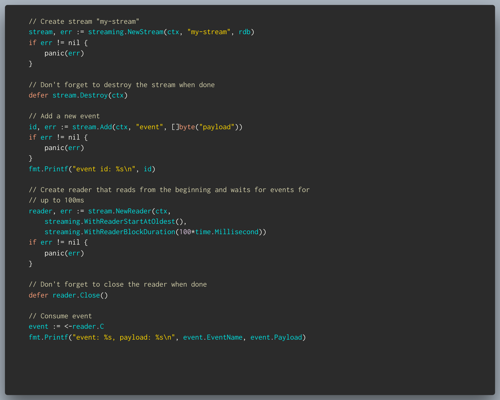</a>
</p>

The code above creates a stream named "my-stream" and adds a new event to it.
The event is then consumed by a reader. The reader is closed after the event
is consumed.

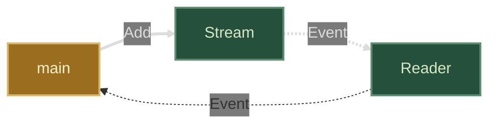

Multiple readers can be created for the same stream across many nodes. Readers
are independent and each instance receives a copy of the same events. Readers
can specify a start position for the stream cursor. The default start position
is the last event in the stream.

<a href="../examples/streaming/multi-reader/main.go">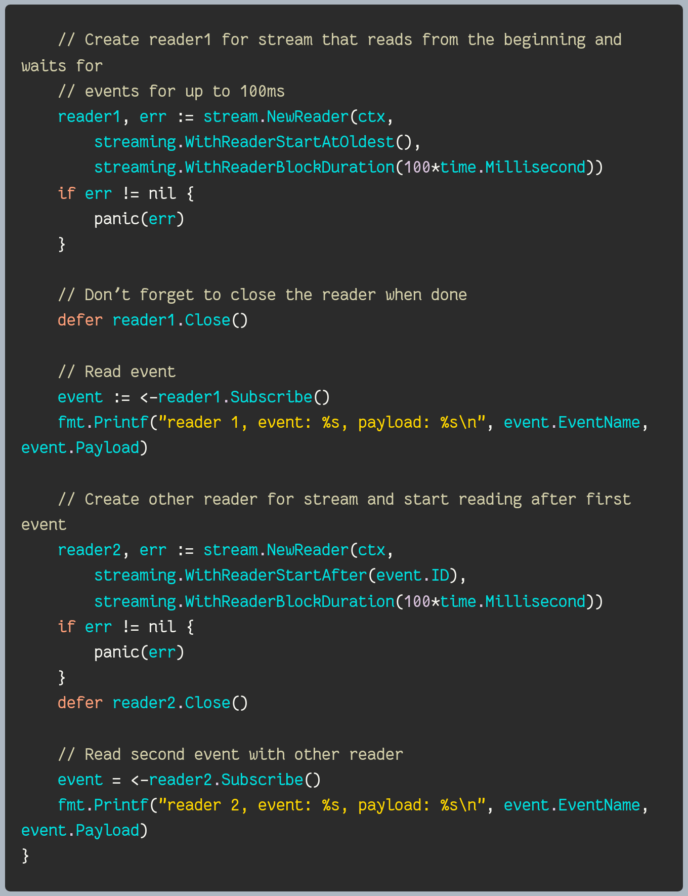</a>

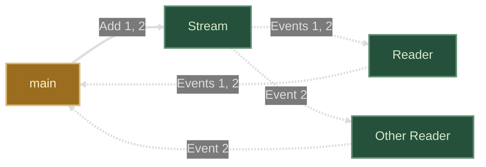

## Event Sinks

Event sinks enable concurrent processing of a sequence of events for better
performance. They also enable redundancy in case of node failure or network
partitions.

Event sinks make it possible for multiple nodes to share the same stream cursor.
If a stream contains 3 events and 3 nodes are consuming the stream using the
same sink (i.e. a sink with the same name), then each node will receive a unique
event from the sequence. Nodes using a different sink (or a reader) will receive
copies of the same events.  

Events read from a sink must be acknowledged by the client. Ponos automatically
requeues events added to a sink that have been read by a node but not
acknowledged.

Creating a sink is as simple as:

<a href="../examples/streaming/single-sink/main.go">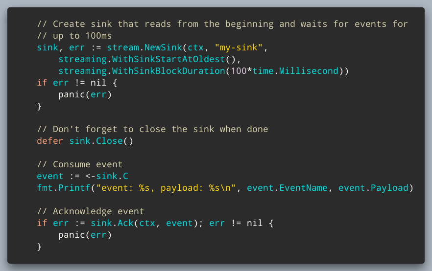</a>

Note a couple of differences with the reader example above:

- Sinks are given a name during creation, multiple nodes using the same name
  share the same stream cursor.
- Events are acknowledged using `sink.Ack`. This provides an at-least-once
  delivery guarantee where unacknowledged events are automatically re-queued.

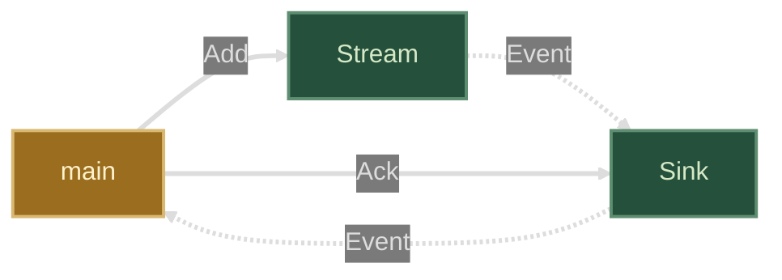

As with readers, multiple sinks can be created for the same stream. Copies of
the same event are distributed among all sinks.

<a href="../examples/streaming/multi-sink/main.go">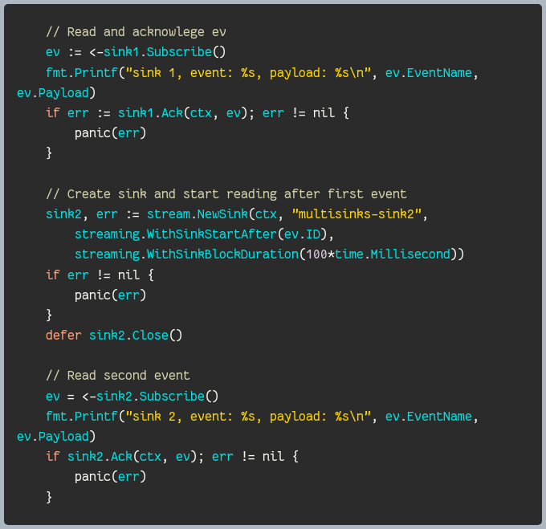</a>

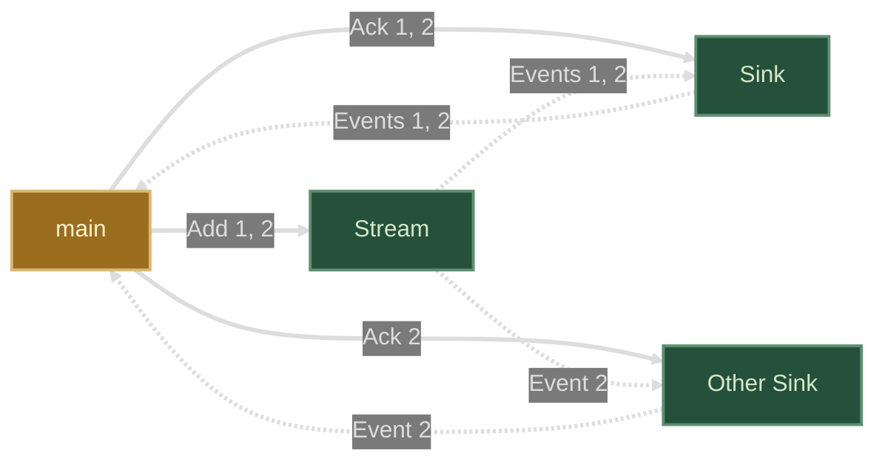

## Reading from multiple streams

Readers and sinks can also read concurrently from multiple streams.  For
example:

<a href="../examples/streaming/multi-stream/main.go">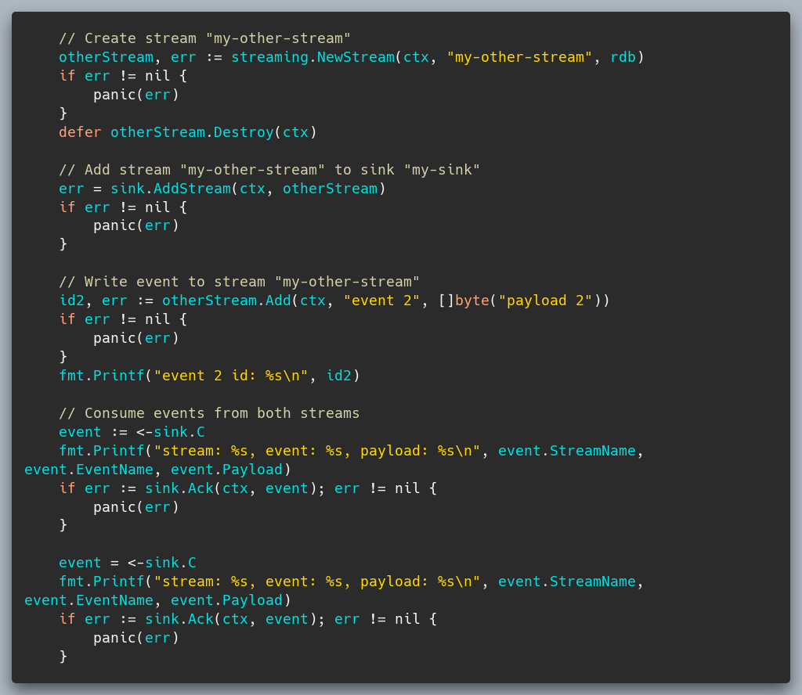</a>

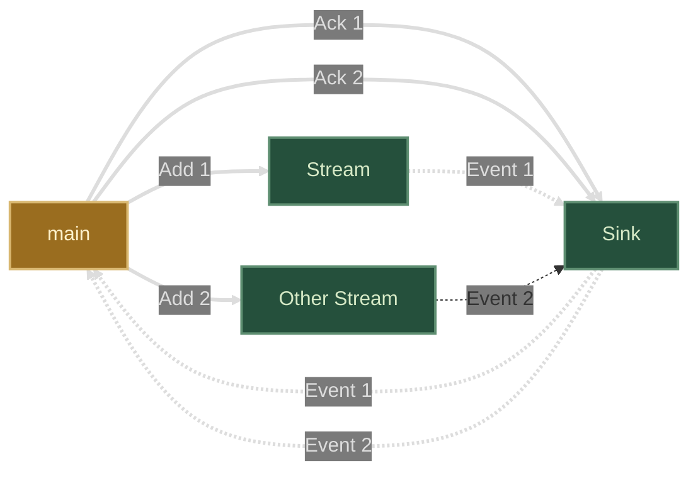

`AddStream` can be called at any time to add new streams to a reader or a sink.
Streams can also be removed using `RemoveStream`.

```go
// Remove stream "my-other-stream" from sink "my-sink"
sink.RemoveStream(otherStream)
```

## Pub/Sub

Streams supports a flexible pub/sub mechanism where events can be attached to
topics and readers or sinks can define simple or custom matching logic.

https://github.com/goadesign/ponos/blob/a23bf7cb3d77b336382e0991967224c5bdb9a35f/examples/streaming/pub-sub/main.go#L21-L40
https://github.com/goadesign/ponos/tree/main/examples/streaming/pub-sub/main.go#L21-L40

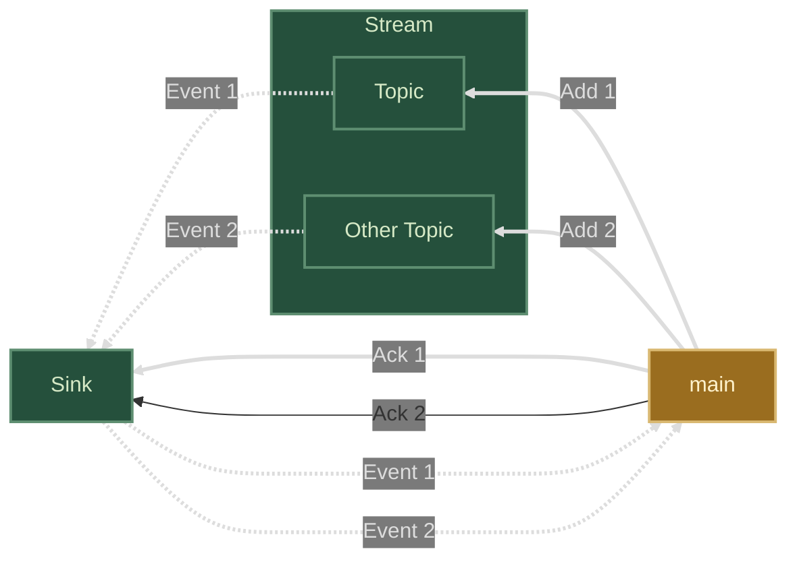

Topics can be matched using their name as in the example above or using complex
patterns. For example:

```go
sink, err := stream.NewSink(ctx, "my-sink", ponos.WithSinkTopicPattern("my-topic.*"))
```

Custom matching logic can also be provided:

```go
sink, err := stream.NewSink(ctx, "my-sink", ponos.WithSinkEventMatcher(
    func(event *ponos.Event) bool {
        return event.Topic == "my-topic" && event.EventName == "event"
    }))
```

> Note: Event filtering is done locally in the sink or reader and does not
> affect the underlying stream. This means that events are still stored in the
> stream and can be consumed by other sinks.