# Streaming

Pulse leverages Redis streams to provide scalable and reliable event streams
that can be used to implement distributed architectures. Pulse provides a simple
API to create and consume streams, for example:

[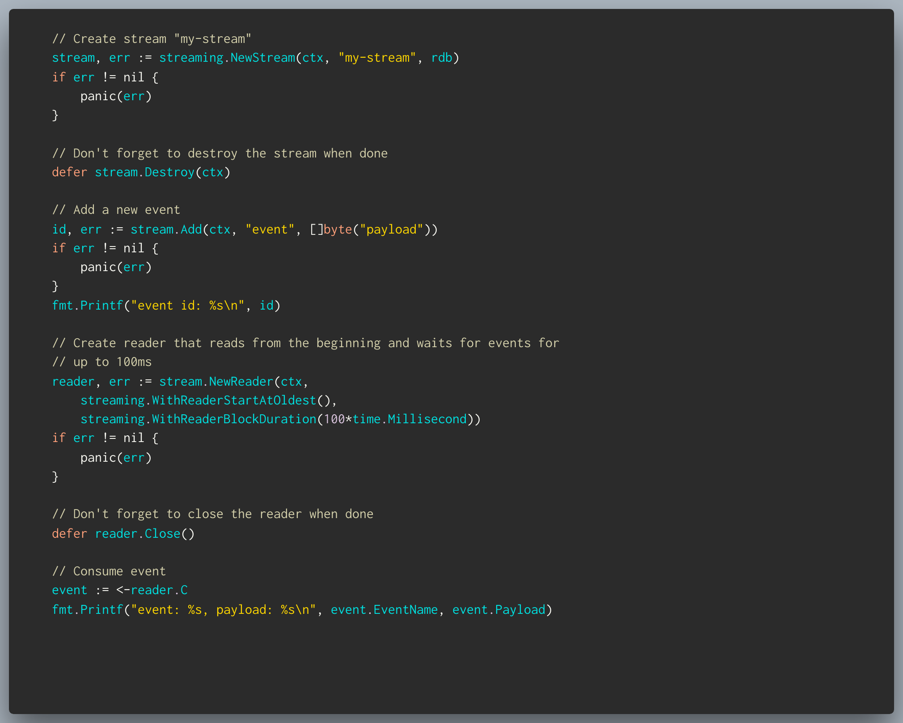](../examples/streaming/single-reader/main.go#L22-L55)

The code above creates a stream and adds a new event to it.  The event is then
consumed by a reader. The reader is closed after the event is consumed.

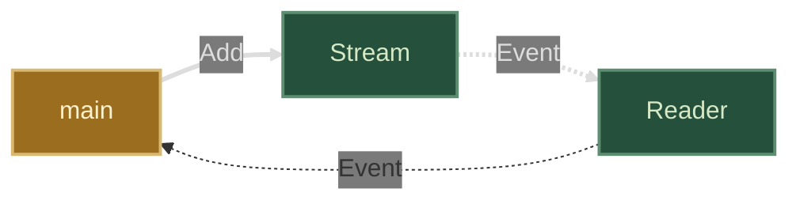
```mermaid
%%{init: {'themeVariables': { 'background': '#282828', 'mainBkg': '#282828', 'edgeLabelBackground': '#7A7A7A'}}}%%
flowchart LR
    main-->|Add|Stream
    Stream-.->|Event|Reader
    Reader-.->|Event|main

    classDef userCode fill:#9A6D1F, stroke:#D9B871, stroke-width:2px, color:#FFF2CC;
    classDef pulse fill:#25503C, stroke:#5E8E71, stroke-width:2px, color:#D6E9C6;

    class main userCode;
    class Stream,Reader pulse;

    linkStyle 0 stroke:#DDDDDD,color:#DDDDDD,stroke-width:3px;
    linkStyle 1 stroke:#DDDDDD,color:#DDDDDD,stroke-width:3px;
```

Multiple readers can be created for the same stream across many nodes. Readers
are independent and each instance receives a copy of the same events. Readers
can specify a start position for the stream cursor. The default start position
is the last event in the stream. `NewReader` is non-creating: the stream must
already have an active lifecycle established by a writer or an explicit
`Stream.Open`, otherwise it returns `ErrStreamNotFound`.

Reader and sink Redis block durations are always finite and positive. The
default is five seconds; `WithReaderBlockDuration` and
`WithSinkBlockDuration` may shorten or lengthen that bound but constructors
reject zero and negative durations. This guarantees `Close` can finish after at
most the configured blocking read even when a Redis client does not interrupt
the command on context cancellation. The examples use 100 milliseconds.
Constructor contexts bound setup only. Reader and Sink background loops use
their own lifecycle contexts and stop only when `Close` or a terminal lifecycle
error cancels them.

[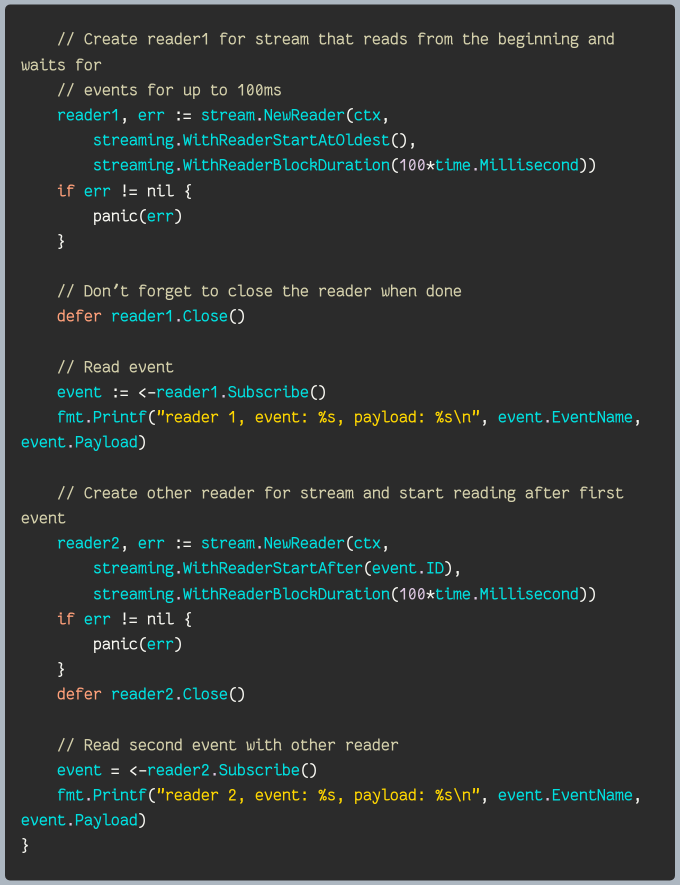](../examples/streaming/multi-readers/main.go#L44-L78)

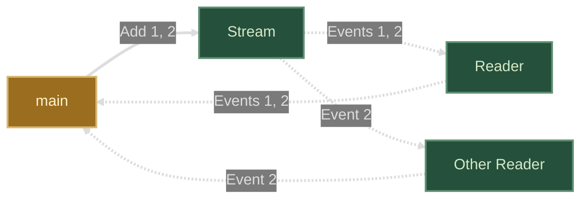
```mermaid
%%{init: {'themeVariables': { 'background': '#282828', 'edgeLabelBackground': '#7A7A7A'}}}%%
flowchart LR
    main-->|Add 1, 2|Stream
    Reader-.->|Events 1, 2|main
    Reader2-.->|Event 2|main
    Stream-.->|Events 1, 2|Reader
    Stream-.->|Event 2|Reader2[Other Reader]

    classDef userCode fill:#9A6D1F, stroke:#D9B871, stroke-width:2px, color:#FFF2CC;
    classDef pulse fill:#25503C, stroke:#5E8E71, stroke-width:2px, color:#D6E9C6;

    class main userCode;
    class Stream,Reader,Reader2 pulse;

    linkStyle 0 stroke:#DDDDDD,color:#DDDDDD,stroke-width:3px;
    linkStyle 1 stroke:#DDDDDD,color:#DDDDDD,stroke-width:3px;
    linkStyle 2 stroke:#DDDDDD,color:#DDDDDD,stroke-width:3px;
    linkStyle 3 stroke:#DDDDDD,color:#DDDDDD,stroke-width:3px;
    linkStyle 4 stroke:#DDDDDD,color:#DDDDDD,stroke-width:3px;
```

## Exact publication and snapshots

`Stream.AddOnce` publishes an event exactly once for a non-empty idempotency key
of at most 256 bytes. The length-delimited name, topic, and payload may total at
most 1 MiB. The first call records those exact canonical bytes with the event
ID; no digest is used. An exact retry returns the same ID, while reusing the key
for different bytes returns `ErrIdempotencyConflict`. The event and its
generation-scoped dedupe record share the stream's finite expiry, so retrying
an ambiguous client result is safe even after max-length trimming removes the
event itself. The returned ID remains the publication result while that retry
record is retained.

`AddOnce` accepts generations configured with an absolute deadline, a fixed
TTL, or a sliding TTL. A handle may adopt the active retention by omitting
retention options; an explicitly configured handle must match the complete
retention contract. Ordinary `Add` calls never extend an absolute deadline or
fixed TTL. On a sliding TTL, every ordinary or exact publication refreshes the
stream, dedupe records, and recovery metadata together. At or after an absolute
deadline, Add, AddOnce, and Snapshot return `ErrDeadlineElapsed`; Sink.Close
treats expiry as terminal and still closes its local subscriptions. Reuse of
that deadline-owned logical name requires explicit `Destroy` followed by
construction of a new generation. The lifecycle record intentionally survives
expiry until Destroy so stale handles remain fenced.

`Stream.Snapshot` performs one generation-fenced Lua `XRANGE COUNT MaxLen+1`
and returns currently retained immutable `SnapshotEvent` values in Redis ID
order. The generation must have a bounded MaxLen; an unbounded stream returns
`ErrSnapshotUnbounded` before Redis runs `XRANGE`. The count bounds Redis script
work, reply size, and client memory. More than MaxLen physical entries violates
the immutable retention contract and returns `ErrSnapshotBoundExceeded` without
materializing the full stream. Snapshot creates no lifecycle, stream, reader,
consumer group, recovery cursor, or acknowledgement state. An uninitialized
name returns `ErrStreamNotFound`. If any externally written entry is malformed,
Snapshot returns a precise error and no partial result.

[Exact publication example](../examples/streaming/exact-publication/main.go)

## Stream retention (TTL)

By default, streams have no retention beyond max-length trimming and must be
deleted explicitly. Pulse can also set a TTL on the Redis key backing a stream:

- `options.WithStreamTTL(ttl)` sets an **absolute TTL** (set once when the key
  is created and never extended).
- `options.WithStreamSlidingTTL(ttl)` sets a **sliding TTL** (refreshed on every
  published event).

TTL values and Reader/Sink timing values use Redis millisecond precision and
must be at least one millisecond. TTL options cannot be combined with
`options.WithStreamDeadline`.
`options.WithUnboundedStream` disables trimming and requires callers to delete
settled events explicitly; it cannot be combined with `WithStreamMaxLen`.

The generation lifecycle owns one immutable retention configuration: maximum
length (or explicit unbounded mode), retention mode, TTL duration and sliding
flag, or absolute deadline. A handle with explicit retention options must match
exactly. A handle with no retention options adopts the active generation;
when its first write creates a name, it establishes the default of maximum
length 1000 with no TTL. Reader, Sink, Snapshot, and Destroy handles can
therefore adopt a writer configuration such as maximum length 50,000 with
sliding TTL without restating it. At the quiescent upgrade boundary, the first
upgraded writer that explicitly adopts bounded retention for a legacy flat
stream atomically trims the physical stream to MaxLen before publishing the
lifecycle configuration. Subsequent bounded writes preserve that hard limit.
`Stream.MaxLen` remains exported for v1 source compatibility and reflects the
constructor value, then the adopted generation value after `Open`. Mutating the
field is unsupported: all operations use the immutable construction/adoption
snapshot, so field mutation cannot weaken retention fencing.

The TTL is applied when the Redis stream key is first created, which happens on
the first publish (`XADD`) or when creating a sink (`XGROUP CREATE ... MKSTREAM`).
Lifecycle and sink-recovery metadata do not expire with event data. A sink can
therefore recover its acknowledged cursor after the physical stream expires,
without using `$` and skipping events published before recovery. Explicit
`Stream.Destroy` removes recovery and exact-publication metadata; the small
lifecycle record remains as the monotonic incarnation source.

## Stream incarnations

`NewStream` is a local constructor and performs no Redis I/O. `Open` or the
first mutating caller-context operation establishes or loads the one active
Redis-owned generation for a logical stream name. Non-creating reads load only
an existing generation and return `ErrStreamNotFound` when none exists. Every
`Stream`, `Reader`, `Sink`, event acker, and added stream then retains that
immutable generation. Publishing, deleting events, consumer-group recovery,
consumer registration, keep-alive refresh, acknowledgement, and destruction
verify it atomically in Redis, so a destroyed generation's metadata can never
be recreated by a concurrent sink.

`Stream.Destroy` invalidates and deletes exactly its generation, including its
events, consumer groups, recovery cursors, exact-publication records, sink
configuration, keepalives, leases, and membership. An unbound handle for an
absent name returns `ErrStreamNotFound` without creating a lifecycle. Reads that
begin after invalidation return
`ErrStreamDestroyed` and cannot cross into a later generation. An event fetched
before `Destroy` may already be executing in application code; its
`StreamGeneration` token identifies that old incarnation for handlers that
must fence side effects. Physical-key isolation guarantees that no
later-generation event can enter the old reader, sink, or pending-entry list.
Repeating `Destroy` for that generation is idempotent. Generation-qualified
metadata keys are deleted because they are never reused; the one small
lifecycle record remains as the bounded monotonic source for the logical name.

Generation one records the compatible `pulse:stream:<name>` physical key, so
Pulse adopts streams and consumer groups created before generation fencing
without moving queued or pending events. After explicit destruction, the next
generation receives a distinct physical key. Each handle stores the
lifecycle-selected key, and reads verify that lifecycle both before and after
Redis returns, so an old reader or sink cannot consume a recreated stream.

Sink stale recovery uses a Redis-time lease with an owner token and monotonic
fencing token. Each `XAUTOCLAIM` and each stale-consumer inspection/deletion
verifies that exact unexpired capability in the same Lua operation as the PEL,
group, keepalive, and membership mutation. A paused predecessor therefore
cannot mutate recovery state after another replica takes over.

Retention-config adoption is a quiescent upgrade: stop every reader, sink, and
publisher; deploy the new version everywhere; open one handle per logical name
with the intended options and verify its lifecycle using
`redis-cli HGETALL "pulse:stream:<name>:lifecycle"`: the active generation,
physical key, and `retention_config` must match that handle. Then resume
traffic. Rollback also requires stopping every user. Do not run an older binary
after the new config is captured; restore the pre-upgrade Redis snapshot or
Destroy and recreate with the rollback version. There is no mixed-version mode.

## Event Sinks

Event sinks enable concurrent processing of a sequence of events for better
performance. They also enable redundancy in case of node failure or network
partitions.

Event sinks make it possible for multiple nodes to share the same stream cursor.
If a stream contains 3 events and 3 nodes are consuming the stream using the
same sink (i.e. a sink with the same name), then each node will receive a unique
event from the sequence; Redis chooses the replica for each event and does not
promise round-robin distribution. Nodes using a different sink name (or a
reader) receive an independent copy.

Events read from a sink must be acknowledged by the client. Pulse automatically
requeues events added to a sink that have been read by a node but not
acknowledged.

Sinks also restore Redis consumer groups deleted outside Pulse. One
generation-scoped recovery hash stores the durable cursor for each named sink. A
cursor advances only across acknowledged events, so pending events and events
added during recovery remain eligible for delivery. `RemoveStream` and
`Sink.Close` detach only that sink instance's membership; they do not delete
the shared consumer group or cursor. Recovery applies only to streams still
attached to the sink instance. `Sink.Close` returns distributed detach failures
without marking the sink closed; callers can retry it with a fresh context.
Removing a stream preserves its shared group and cursor. Pulse deletes an
individual Redis consumer only when that consumer's own PEL is empty, not when
the whole group's PEL is empty. Consumer PEL inspection, optional Redis
consumer deletion, membership removal, and keepalive removal are one
generation-fenced Lua operation. A consumer with pending entries loses local
membership but remains in Redis until stale recovery claims its entries; failed
setup and removal therefore leave no orphaned membership metadata. Stale empty
consumers are also removed by periodic cleanup.

Each attached `(stream generation, sink name)` owns its own keepalive map,
shared configuration, and fenced stale-recovery lease. Cross-primary sinks
that attach the same secondary stream therefore coordinate on that secondary
without coupling their other streams. Replicas must use identical topic or
topic-pattern filters, acknowledgement mode, acknowledgement grace period, and
initial cursor for each attachment; `NewSink` or `AddStream` fails before group
membership on a mismatch. Keepalives are written once per acknowledgement
grace period, and stale-message checks run every 500 milliseconds by default.

Sink and Reader constructors reject non-positive block durations and batch
sizes, negative channel buffers, and non-positive sink acknowledgement grace
periods. Defaults are a five-second block, 1000 events per read, a 1000-event
channel buffer, and a 20-second sink acknowledgement grace period.

`WithSinkNoAck` preserves at-most-once delivery to subscribers by atomically
acknowledging each event and advancing the same recovery cursor before exposing
the event. It does not use Redis's `NOACK` read mode. Both `Sink.Ack` and direct
calls through `Event.Acker` use this recovery-aware acknowledgement operation.

Deleting the physical Redis stream key itself is different: its stored event
payloads are gone and cannot be recovered. Pulse recreates the empty stream and
group at the durable cursor so all subsequently published events are delivered,
and logs the data-loss condition. `AddStream` and `RemoveStream` return
`ErrSinkClosed` after sink shutdown begins. Removing the final stream from a
Reader or Sink returns `ErrLastStream`, preserving a valid Redis read set. Explicit
`Stream.Destroy` is the only operation that deletes consumer groups and
recovery state; active sink membership neither blocks nor authorizes exact
generation destruction.

Once Reader or Sink shutdown starts, new subscriptions return an already
closed channel. Reader stream changes return `ErrReaderClosed`, and Sink stream
changes return `ErrSinkClosed`. A sink also atomically acknowledges filtered
events before advancing past them, because no subscriber can acknowledge an
event it never receives. Reader filters remain observational and do not mutate
stream state.

## Redis topology

Streaming follows Pulse's standalone Redis contract. Physical event data,
lifecycle metadata, recovery, and replicated-map keys are intentionally
separate readable keys, and atomic Lua operations may access several of them.
`AddOnce` and `Snapshot` follow the same contract. Redis Cluster cross-slot
execution is not supported.

Creating a sink is as simple as:

[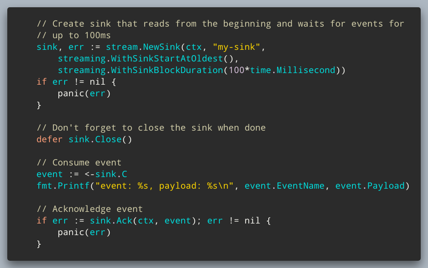](../examples/streaming/single-sink/main.go#L42-L65)

Note a couple of differences with the reader example above:

- Sinks are given a name during creation, multiple nodes using the same name
  share the same stream cursor.
- Events are acknowledged using `sink.Ack`. This provides an at-least-once
  delivery guarantee where unacknowledged events are automatically re-queued.

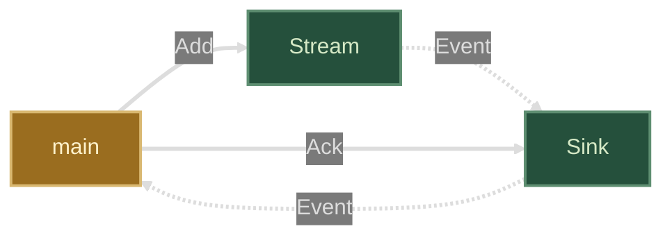
```mermaid
%%{init: {'themeVariables': { 'background': '#282828', 'edgeLabelBackground': '#7A7A7A'}}}%%
flowchart LR
    main
    Stream
    Sink
    main-->|Add|Stream
    Stream-.->|Event|Sink
    Sink-.->|Event|main
    main-->|Ack|Sink

    classDef userCode fill:#9A6D1F, stroke:#D9B871, stroke-width:2px, color:#FFF2CC;
    classDef pulse fill:#25503C, stroke:#5E8E71, stroke-width:2px, color:#D6E9C6;

    class main userCode;
    class Stream,Sink pulse;

    linkStyle 0 stroke:#DDDDDD,color:#DDDDDD,stroke-width:3px;
    linkStyle 1 stroke:#DDDDDD,color:#DDDDDD,stroke-width:3px;
    linkStyle 2 stroke:#DDDDDD,color:#DDDDDD,stroke-width:3px;
    linkStyle 3 stroke:#DDDDDD,color:#DDDDDD,stroke-width:3px;
```

As with readers, multiple sink groups can be created for the same stream.
Different sink names each receive a copy; replicas sharing one sink name divide
that group's events.

[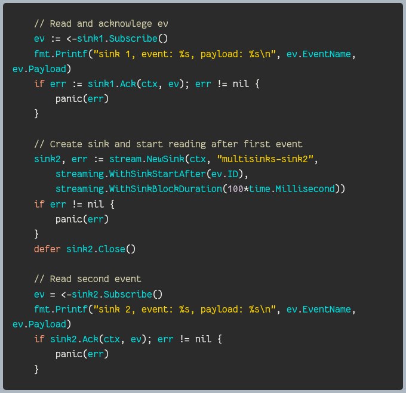](../examples/streaming/multi-sinks/main.go#L53-L89)

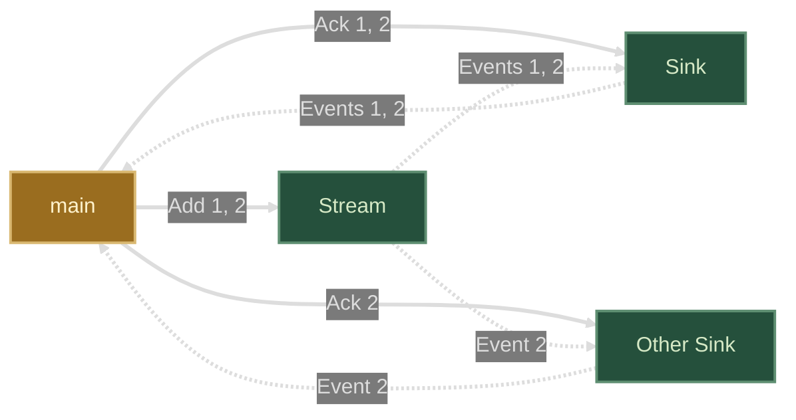
```mermaid
%%{init: {'themeVariables': { 'background': '#282828', 'edgeLabelBackground': '#7A7A7A'}}}%%
flowchart LR
    main-->|Add 1, 2|Stream
    Sink-.->|Events 1, 2|main
    main-->|Ack 1, 2|Sink
    Sink2-.->|Event 2|main
    main-->|Ack 2|Sink2
    Stream-.->|Events 1, 2|Sink
    Stream-.->|Event 2|Sink2[Other Sink]

    classDef userCode fill:#9A6D1F, stroke:#D9B871, stroke-width:2px, color:#FFF2CC;
    classDef pulse fill:#25503C, stroke:#5E8E71, stroke-width:2px, color:#D6E9C6;

    class main userCode;
    class Stream,Sink,Sink2 pulse;

    linkStyle 0 stroke:#DDDDDD,color:#DDDDDD,stroke-width:3px;
    linkStyle 1 stroke:#DDDDDD,color:#DDDDDD,stroke-width:3px;
    linkStyle 2 stroke:#DDDDDD,color:#DDDDDD,stroke-width:3px;
    linkStyle 3 stroke:#DDDDDD,color:#DDDDDD,stroke-width:3px;
    linkStyle 4 stroke:#DDDDDD,color:#DDDDDD,stroke-width:3px;
    linkStyle 5 stroke:#DDDDDD,color:#DDDDDD,stroke-width:3px;
    linkStyle 6 stroke:#DDDDDD,color:#DDDDDD,stroke-width:3px;
```

## Failure recovery

Sinks are designed to survive Redis state loss without dropping acknowledged
work or losing unacknowledged events:

- **Lossless consumer group recovery**: each sink keeps a durable *recovery
  cursor* per stream (the highest event ID known to be fully acknowledged),
  advanced atomically with every acknowledgment from the exact pending entry
  list state. When the Redis consumer group disappears (e.g. `XGROUP DESTROY`
  or key loss) the sink recreates the group at the recovery cursor — never at
  `$` — so every unacknowledged event is redelivered and no acknowledged event
  is replayed. Events acknowledged out of order ahead of the cursor may be
  redelivered after recovery (at-least-once).
- **Jittered retries**: transient Redis failures in readers and sinks are
  retried with exponential backoff jittered between half and full of the
  current delay so replicas do not retry in lockstep.
- **Prompt shutdown**: `Sink.Close` cancels all sink-owned Redis I/O,
  including blocked reads and recovery in progress. `AddStream` and
  `RemoveStream` return `ErrSinkClosed` after `Close`.
- **Fenced maintenance**: idle-message claiming (`XAUTOCLAIM`) and stale
  consumer cleanup run under a per-stream lease fenced with Redis time; lease
  renewal and the guarded mutation are one atomic operation so a stale sink
  instance can never mutate the pending entry list after another instance
  takes over.
- **Destroy fence**: `Stream.Destroy` atomically deletes the stream and all
  its sink metadata and marks the stream destroyed. Concurrent sinks observe
  the destruction and drop the stream instead of resurrecting its metadata;
  only a subsequent `NewSink` or `AddStream` deliberately recreates it.
- The stream TTL (see above) is restored whenever a sink attaches to the
  stream, even when the consumer group already exists.

## Reading from multiple streams

Readers and sinks can also read concurrently from multiple streams:

[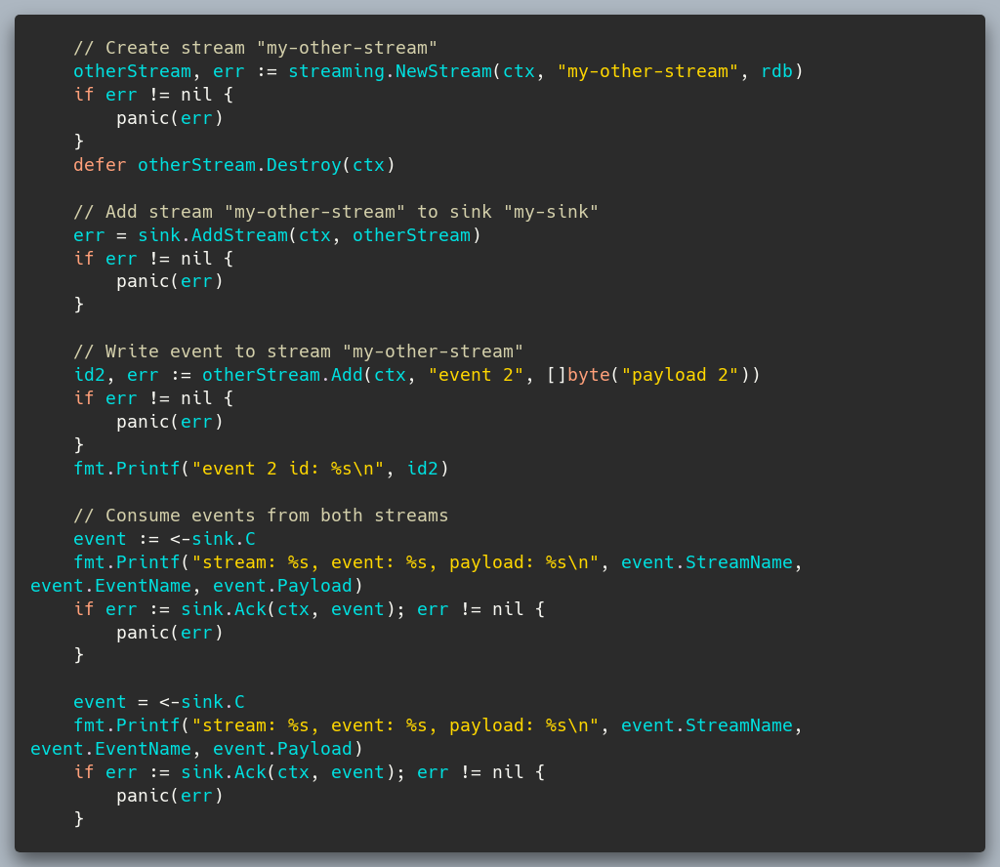](../examples/streaming/multi-streams/main.go#L63-L83)

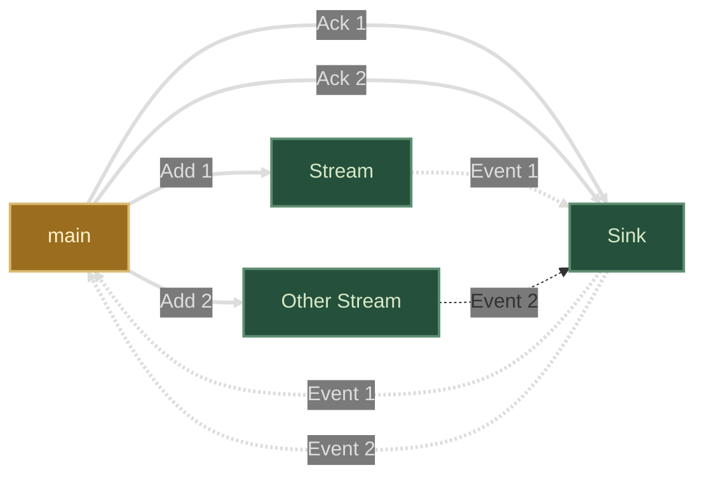
```mermaid
%%{init: {'themeVariables': { 'background': '#282828', 'edgeLabelBackground': '#7A7A7A'}}}%%
flowchart LR
    main-->|Add 1|Stream
    main-->|Add 2|Stream2[Other Stream]
    Sink-.->|Event 1|main
    Sink-.->|Event 2|main
    main-->|Ack 1|Sink
    main-->|Ack 2|Sink
    Stream-.->|Event 1|Sink
    Stream2-.->|Event 2|Sink

    classDef userCode fill:#9A6D1F, stroke:#D9B871, stroke-width:2px, color:#FFF2CC;
    classDef pulse fill:#25503C, stroke:#5E8E71, stroke-width:2px, color:#D6E9C6;

    class main userCode;
    class Stream,Stream2,Sink pulse;

    linkStyle 0 stroke:#DDDDDD,color:#DDDDDD,stroke-width:3px;
    linkStyle 1 stroke:#DDDDDD,color:#DDDDDD,stroke-width:3px;
    linkStyle 2 stroke:#DDDDDD,color:#DDDDDD,stroke-width:3px;
    linkStyle 3 stroke:#DDDDDD,color:#DDDDDD,stroke-width:3px;
    linkStyle 4 stroke:#DDDDDD,color:#DDDDDD,stroke-width:3px;
    linkStyle 5 stroke:#DDDDDD,color:#DDDDDD,stroke-width:3px;
    linkStyle 6 stroke:#DDDDDD,color:#DDDDDD,stroke-width:3px;
```

`AddStream` can be called at any time to add new streams to a reader or a sink.
Streams can also be removed using `RemoveStream`. Topic and topic-pattern
filters are mutually exclusive, as are the cursor-start options; constructors
and `AddStream` reject conflicting choices instead of applying precedence.

[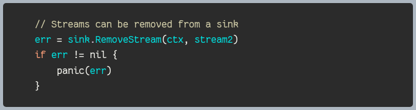](../examples/streaming/multi-streams/main.go#L100-L104)

## Pub/Sub

Streams supports a flexible pub/sub mechanism where events can be attached to
topics and readers or sinks can define simple or custom matching logic.

[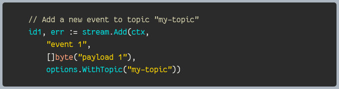](../examples/streaming/pub-sub/main.go#L36-L40)

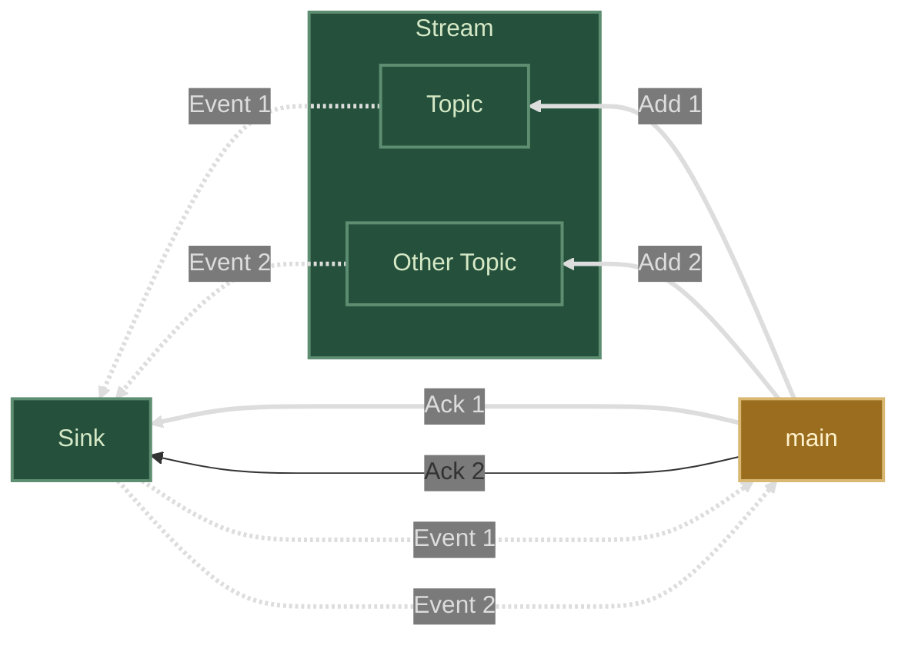
```mermaid
%%{init: {'themeVariables': { 'background': '#282828', 'edgeLabelBackground': '#7A7A7A'}}}%%
flowchart RL
    main-->|Add 1|Topic
    main-->|Add 2|Topic2
    subgraph Stream
        Topic2[Other Topic]
        Topic
    end
    Topic-.->|Event 1|Sink
    Topic2-.->|Event 2|Sink
    Sink-.->|Event 1|main
    Sink-.->|Event 2|main
    main-->|Ack 1|Sink
    main-->|Ack 2|Sink

    classDef userCode fill:#9A6D1F, stroke:#D9B871, stroke-width:2px, color:#FFF2CC;
    classDef pulse fill:#25503C, stroke:#5E8E71, stroke-width:2px, color:#D6E9C6;

    class main userCode;
    class Stream,Topic,Topic2,Sink pulse;

    linkStyle 0 stroke:#DDDDDD,color:#DDDDDD,stroke-width:3px;
    linkStyle 1 stroke:#DDDDDD,color:#DDDDDD,stroke-width:3px;
    linkStyle 2 stroke:#DDDDDD,color:#DDDDDD,stroke-width:3px;
    linkStyle 3 stroke:#DDDDDD,color:#DDDDDD,stroke-width:3px;
    linkStyle 4 stroke:#DDDDDD,color:#DDDDDD,stroke-width:3px;
    linkStyle 5 stroke:#DDDDDD,color:#DDDDDD,stroke-width:3px;
    linkStyle 6 stroke:#DDDDDD,color:#DDDDDD,stroke-width:3px;
```

Topics can be matched using their name as in the example above or using complex
patterns. For example:

[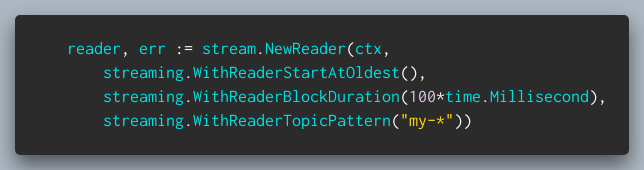](../examples/streaming/pub-sub/main.go#L85-L88)

> Note: Event filtering is evaluated client-side and never removes an event
> from the stream. Reader filtering is observational. A sink filter
> acknowledges non-matching events in that sink's consumer group because no
> subscriber can acknowledge an event it never receives; other sink names and
> readers remain independent.

## Examples

The [examples](../examples/streaming) directory contains a number of examples
that demonstrate the basic usage of the `streaming` package.