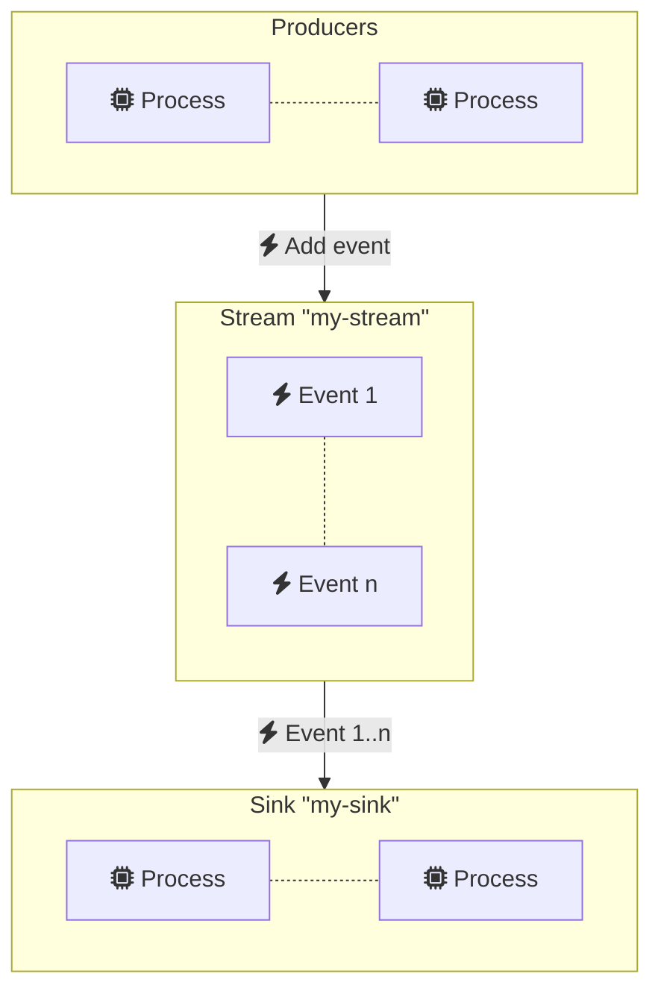

# Streaming

Ponos leverages Redis streams to provide scalable and reliable event streams
that can be used to implement distributed architectures. Ponos provides a simple
API to create and consume streams, for example:

```go
package main

import (
    redis "github.com/redis/go-redis/v9"
    "goa.design/ponos/streams"
)

func main() {
    // Connect to Redis
    rdb := redis.NewClient(&redis.Options{ Addr: "localhost:6379" })

    // Create stream "my-stream"
    stream, err := streaming.NewStream(context.Background(), "my-stream", rdb)
    if err != nil {
        panic(err)
    }

    // Add a new event to the stream
    if err := stream.Add(context.Background(), "event", "payload"); err != nil {
        panic(err)
    }

    // Create event reader
    reader := stream.NewReader()

    // Consume event
    event := <-reader.C 
    fmt.Printf("event: %s, payload: %s\n", event.Name, event.Payload)

    // Cleanup
    reader.Stop()
}
```

The code above creates a stream named "my-stream" and adds a new event to it.
The event is then consumed by a reader. The reader is stopped after the event
is consumed.

Multiple readers can be created for the same stream across many nodes. Readers
are independent and each instance receives a copy of the same events. Readers
can specify a start position for the stream cursor. The default start position
is the last event in the stream.

```go
// Create stream "my-stream"
stream, err := streaming.NewStream(context.Background(), "my-stream", rdb)

// Write 2 events to the stream
stream.Add(context.Background(), "event1", "payload1")
stream.Add(context.Background(), "event2", "payload2")

// Create reader for stream "my-stream" and read from the beginning
reader := streaming.NewReader(context.Background(), streaming.WithReaderStartAtOldest())

// Read both events
event := <-reader.C
fmt.Printf("reader 1, event: %s, payload: %s\n", event.Name, event.Payload)
// Prints "reader 1, event: event1, payload: payload1"
event = <-reader.C
fmt.Printf("reader 1, event: %s, payload: %s\n", event.Name, event.Payload)
// Prints "reader 1, event: event2, payload: payload2"

// Create another reader for stream "my-stream" and start reading after the
// first event
otherReader := streaming.NewReader(context.Background(), streaming.WithReaderStartAt(event.ID))

// Read second event
event = <-otherReader.C
fmt.Printf("reader 2, event: %s, payload: %s\n", event.Name, event.Payload)
// Prints "reader 2, event: event2, payload: payload2"
```

## Event Sinks

Event sinks enable concurrent processing of multiple events for better
performance.  They also enable redundancy in case of node failure or network
partitions.

Event sinks make it possible for multiple nodes to share the same stream cursor.
If a stream contains 3 events and 3 nodes are consuming the stream using the
same sink (i.e. a sink with the same name), then each node will receive a unique
event from the sequence. Nodes using a different sink (or a reader) will receive
copies of the same events.  

Sink events must be acknowledged by the client. Ponos automatically requeues
events added to a sink that have been read by a node but not acknowledged.

Creating a sink is as simple as:

```go
// Create stream "my-stream"
stream, err := streaming.NewStream(context.Background(), "my-stream", rdb)
if err != nil {
    panic(err)
}

// Create sink "my-sink" for stream "my-stream"
sink := stream.NewSink(context.Background(), "my-sink")
defer sink.Close()

// Consume event
event := <-sink.C
fmt.Printf("event: %s, payload: %s\n", event.Name, event.Payload)
event.Ack()
```

Note a couple of differences with the reader example above:

- The sink is created using `stream.NewSink(context.Background(), "my-sink")` instead of
  `streaming.NewReader(context.Background())`. Each sink has a unique name, multiple nodes
  using the same name will share the same stream cursor.
- The event is acknowledged using `event.Ack()`. This is required to advance the stream cursor
  and avoid reprocessing the same event.



As with readers, multiple sinks can be created for the same stream. Copies of
the same event are distributed among all sinks.


## Reading from multiple streams

Readers and sinks can also read concurrently from multiple streams.  For
example:

```go
// Create stream "my-stream"
stream, err := streaming.NewStream(context.Background(), "my-stream", rdb)
if err != nil {
    panic(err)
}

// Create sink "my-sink" for stream "my-stream"
sink := stream.NewSink("my-sink")
defer sink.Close()

// Create stream "my-other-stream"
otherStream := streaming.NewStream(context.Background(), "my-other-stream", rdb)

// Add stream "my-other-stream" to sink "my-sink"
sink.AddStream(otherStream)

// Consume events from both streams
for event := range sink.C {
    fmt.Printf("stream: %s, event: %s, payload: %s\n", event.StreamName, event.Event, event.Payload)
    event.Ack()
}
```


`AddStream` can be called at any time to add new streams to a reader or a sink.
Streams can also be removed using `RemoveStream`.

```go
// Remove stream "my-other-stream" from sink "my-sink"
sink.RemoveStream(otherStream)
```

## Pub/Sub

Streams supports a flexible pub/sub mechanism where events can be attached to
topics and readers or sinks can define simple or custom matching logic.

```go
// Create topics "my-topic" and "my-other-topic"
topic := stream.NewTopic("my-topic")
otherTopic := stream.NewTopic("my-other-topic")

// Add a new event to topic "my-topic"
if err := topic.Add(ctx, "event", "payload"); err != nil {
    panic(err)
}

// Add a new event to topic "my-other-topic"
if err := otherTopic.Add(ctx, "event", "payload"); err != nil {
    panic(err)
}

// Consume events for topic "my-topic"
sink, err := stream.NewSink(ctx, "my-sink", ponos.WithSinkTopic("my-topic"))
defer sink.Close()
for event := range sink.C {
    fmt.Printf("event: %s, payload: %s\n", event.EventName, event.Payload)
    event.Ack()
}
```


Topics can be matched using their name as in the example above or using complex
patterns. For example:

```go
sink, err := stream.NewSink(ctx, "my-sink", ponos.WithSinkTopicPattern("my-topic.*"))
```

Custom matching logic can also be provided:

```go
sink, err := stream.NewSink(ctx, "my-sink", ponos.WithSinkEventMatcher(
    func(event *ponos.Event) bool {
        return event.Topic == "my-topic" && event.EventName == "event"
    }))
```

> Note: Event filtering is done locally in the sink or reader and does not
> affect the underlying stream. This means that events are still stored in the
> stream and can be consumed by other sinks.