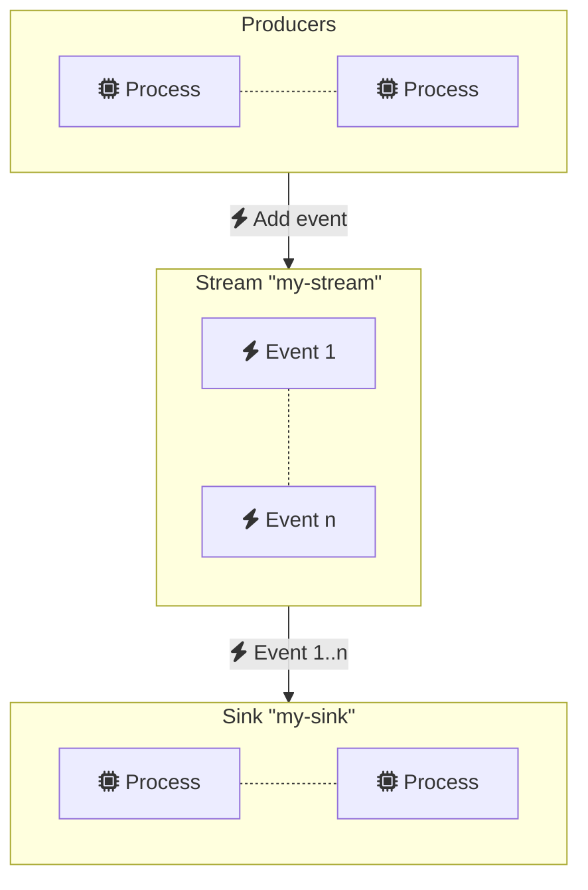
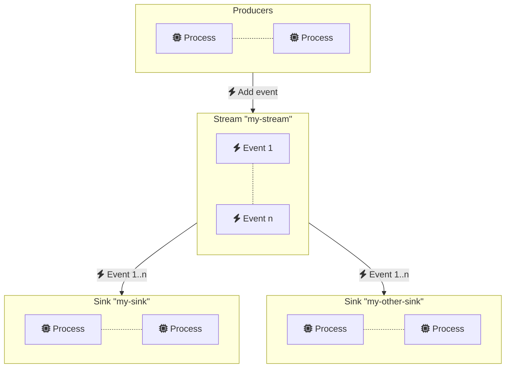
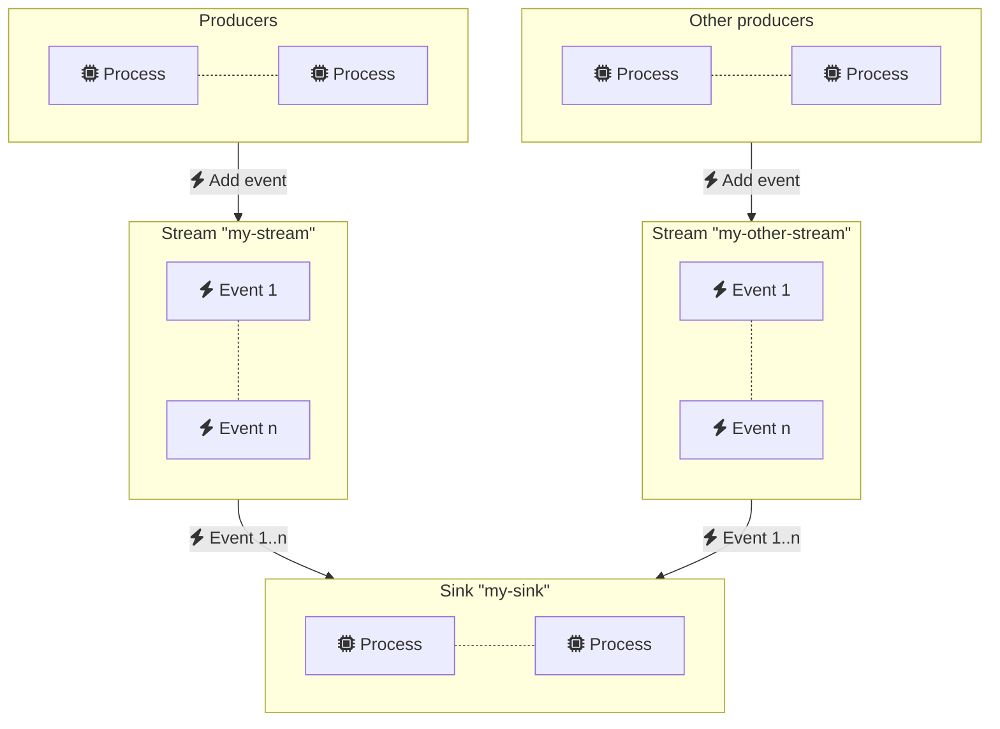
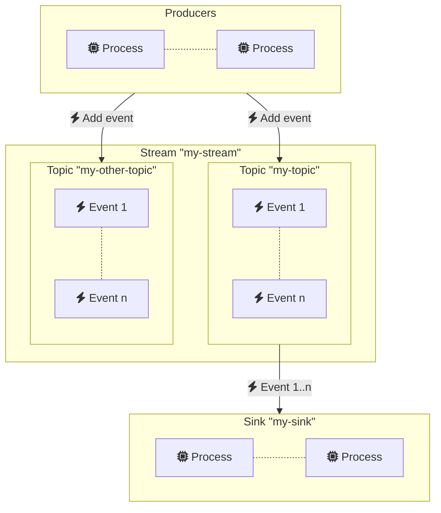

# Streaming

Ponos leverages Redis streams to provide scalable and reliable event streams
that can be used to implement distributed architectures. Ponos provides a simple
API to create and consume streams, for example:

```go
package main

import (
    redis "github.com/go-redis/redis/v8"
    "goa.design/ponos/streams"
)

func main() {
    // Connect to Redis
    conn, err := streams.New(context.Background(), redis.NewClient())
    if err != nil {
        panic(err)
    }

    // Create stream named "my-stream".
    stream := conn.Stream("my-stream")

    // Add a new event
    if err := stream.Add(context.Background(), "event", "payload"); err != nil {
        panic(err)
    }

    // Create event sink
    sink := stream.NewSink("my-sink")
    defer sink.Close()

    // Consume all events  
    for event := range sink.C {
        fmt.Printf("event: %s, payload: %s\n", event.Name, event.Payload)
        event.Ack()
    }
}
```

## Event Sinks

Event sinks allow for concurrent processing of event streams.  Each sink manages
its own stream cursors and thus can consume events independently from other
sinks.

The code above can run concurrently in different processes to create multiple
consumers for the same sink. Events are distributed evenly among the consumers.



Multiple sinks can be created for the same stream. Copies of the same event are
distributed among all sinks.

```go
// Create sink "my-other-sink" for stream "my-stream"
otherSink := stream.NewSink("my-other-sink")
```



## Reading from multiple streams

Sinks can also be used to read concurrently from multiple streams. For example:

```go
// Create stream "my-stream"
stream := ponos.NewStream("my-stream", rdb)

// Create sink "my-sink" for stream "my-stream"
sink := stream.NewSink("my-sink")
defer sink.Close()

// Create stream "my-other-stream"
otherStream := ponos.NewStream("my-other-stream", rdb)

// Add stream "my-other-stream" to sink "my-sink"
sink.AddStream(otherStream)

// Consume events from both streams
for event := range sink.C {
    fmt.Printf("stream: %s, event: %s, payload: %s\n", event.StreamName, event.Event, event.Payload)
    event.Ack()
}
```



`AddStream` can be called at any time to add new streams to a sink. Streams can
also be removed from sinks using `RemoveStream`.

```go
// Remove stream "my-other-stream" from sink "my-sink"
sink.RemoveStream(otherStream)
```

Sinks provide a very versatile mechanism that can be used to create complex
topologies of producers and consumers.

## Pub/Sub

Streams supports a flexible pub/sub mechanism where events can be attached to
topics and sinks can define simple or custom matching logic.

```go
// Create topics "my-topic" and "my-other-topic"
topic := stream.NewTopic("my-topic")
otherTopic := stream.NewTopic("my-other-topic")

// Add a new event to topic "my-topic"
if err := topic.Add(ctx, "event", "payload"); err != nil {
    panic(err)
}

// Add a new event to topic "my-other-topic"
if err := otherTopic.Add(ctx, "event", "payload"); err != nil {
    panic(err)
}

// Consume events for topic "my-topic"
sink := stream.NewSink("my-sink", ponos.WithSinkTopic("my-topic"))
defer sink.Close()
for event := range sink.C {
    fmt.Printf("event: %s, payload: %s\n", event.EventName, event.Payload)
    event.Ack()
}
```



Topics can be matched using their name as in the example above or using complex
patterns. For example:

```go
sink := stream.NewSink("my-sink", ponos.WithSinkTopicPattern("my-topic.*"))
```

Custom matching logic can also be provided:

```go
sink := stream.NewSink("my-sink", ponos.WitSinkhEventMatcher(
    func(event *ponos.Event) bool {
        return event.Topic == "my-topic" && event.EventName == "event"
    }))
```
